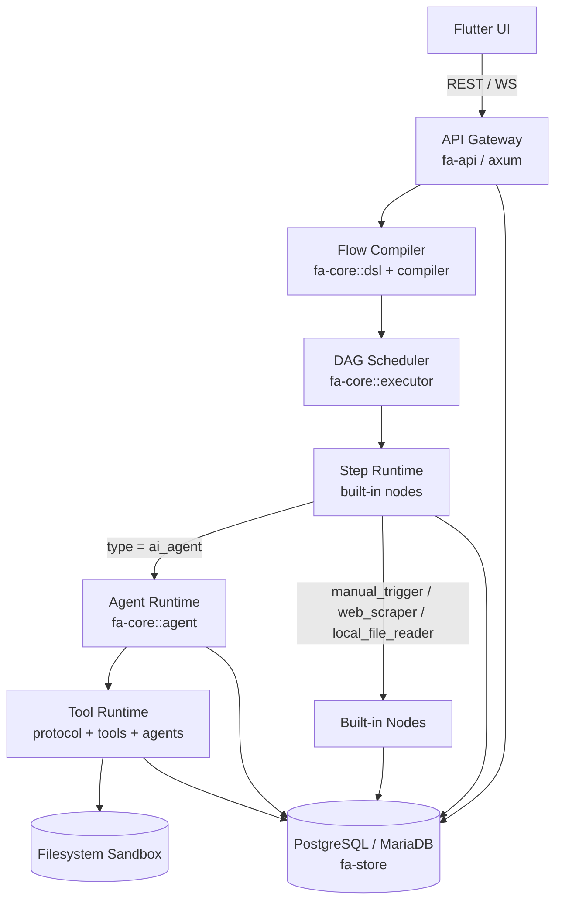

# Architecture Overview

Mục tiêu của file này là cho người mới nhìn 30 giây là nắm được toàn hệ thống.

## Ý nghĩa từng khối

- `Flutter UI`: chỉ làm trình bày, editor DSL, run view, live log.
- `fa-api`: là ranh giới duy nhất giữa FE và engine. Nó nhận REST/WS, validate DSL và bắn event realtime.
- `Flow Compiler`: parse DSL, validate semantic, xây DAG, phát hiện chu trình.
- `DAG Scheduler`: quyết định bước nào chạy tiếp theo, bước nào bị skip.
- `Step Runtime`: chạy các node tuyến tính của flow.
- `Agent Runtime`: chỉ dùng khi step là `ai_agent`; đây là runtime suy luận riêng.
- `Tool Runtime`: registry + dispatch + permissions + tool packs.
- `Filesystem Sandbox`: nơi tool được phép ghi/đọc.
- `PostgreSQL / MariaDB`: nơi lưu `flows`, `flow_runs`, `step_executions`.

## Vì sao kiến trúc này quan trọng

- FE không đụng engine logic.
- Engine logic không phụ thuộc Flutter.
- AI không bị nhét vào mọi step; chỉ node `ai_agent` mới mang tính suy luận.
- Dataflow và observability đều được vật hóa qua DB + event bus.

## Một câu chốt

FlowAgent là:

- `DSL-first` cho phần deterministic,
- `AI runtime-first` cho phần non-deterministic,
- và `local-first` cho cách triển khai.
