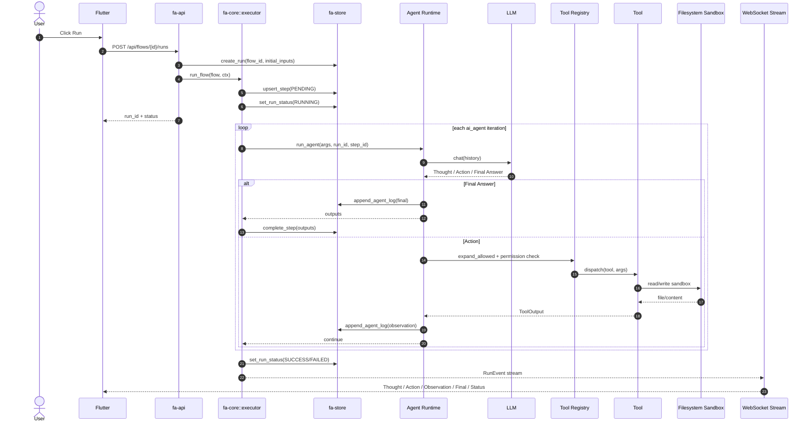

# Sequence Diagram

File này mô tả chuỗi message khi chạy một `ai_agent`.

## Message flow quan trọng

- `Flutter -> fa-api`: chỉ gửi JSON REST/WS.
- `fa-api -> Executor`: chuyển sang core runtime.
- `Executor -> Agent Runtime`: chỉ khi step là `ai_agent`.
- `Agent Runtime -> LLM`: một vòng gọi model.
- `Agent Runtime -> Registry -> Tool`: kiểm tra quyền rồi mới dispatch.
- `Tool -> Filesystem Sandbox`: nơi duy nhất tool được phép chạm file.
- `Executor -> Store`: mọi trạng thái đều đi qua store.
- `Executor -> WS -> Flutter`: log realtime cho UI.

## Điều cần nhớ

- `Observation` không phải output cuối cùng của tool.
- `Observation` là dữ liệu được nối trở lại history để vòng ReAct tiếp tục.
- `RunEvent` và `agent_logs` là hai kênh biểu diễn cùng một sự kiện: một cho realtime UI, một cho lưu trữ/audit.

