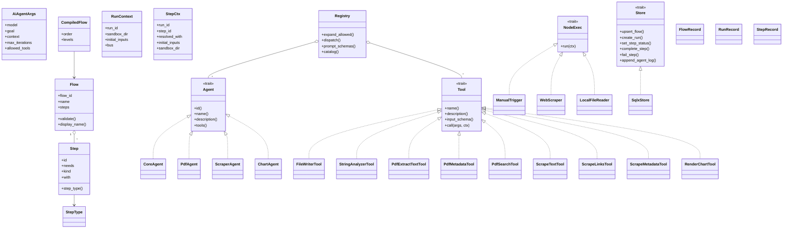

# Class Diagram

FlowAgent dùng Rust, nên đây là class diagram theo nghĩa "struct / trait / module" chứ không phải OOP thuần.

## Cách đọc diagram này

- `Flow` và `Step` là DSL model.
- `CompiledFlow` là kết quả biên dịch DAG.
- `RunContext` là môi trường runtime của một run.
- `StepCtx` là môi trường runtime của một step tuyến tính.
- `NodeExec` là trait cho built-in node.
- `Agent` và `Tool` là lớp mở rộng cho AI/tool ecosystem.
- `Registry` là hub để khai triển `allowed_tools` và dispatch tool.
- `Store` là boundary giữ core engine tách khỏi database cụ thể.

## Nhận xét kiến trúc

Thiết kế này cố tình tránh coupling trực tiếp giữa engine và backend:

- `fa-core` không biết Postgres hay MariaDB.
- `fa-api` chỉ cần `Store`.
- `fa-store` chỉ là một implementation của `Store`.

Đó là lý do FlowAgent có thể đổi backend mà không cần viết lại logic chạy flow.
