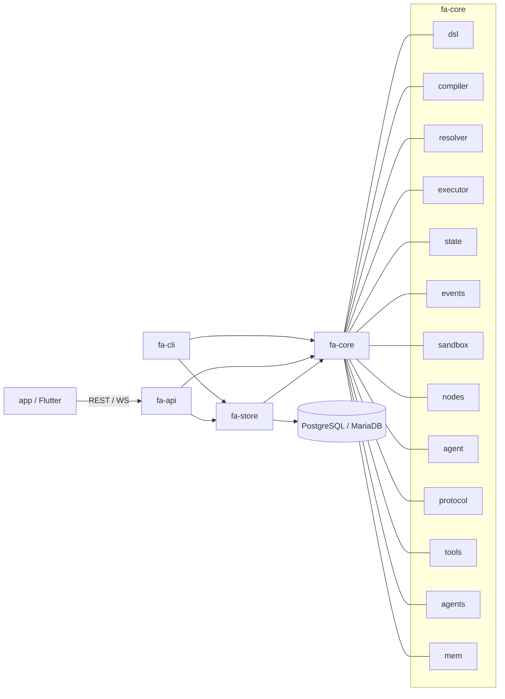

# Package Diagram

Đây là sơ đồ dependency ở cấp crate / package.

## Ý nghĩa dependency

- `app` chỉ nói chuyện với `fa-api`.
- `fa-api` là lớp ghép core + storage + websocket.
- `fa-store` dùng `fa-core::store` và `fa-core::state` để map record.
- `fa-core` là lõi độc lập nhất, chứa parser, compiler, executor, agent, tool registry.
- `fa-cli` là consumer headless, cùng dùng core/store.

## Internal layering của `fa-core`

- `dsl` và `compiler` tạo ra hình dạng workflow.
- `resolver` đọc `step_executions.outputs` từ store.
- `executor` điều phối run, là hub của runtime.
- `agent` chỉ vào khi step là `ai_agent`.
- `protocol` và `tools` mở rộng hệ sinh thái agent/tool.
- `sandbox` bảo vệ file system boundary.
- `events` cấp data cho WS realtime.

## Tóm tắt kiến trúc phụ thuộc

FlowAgent đang chọn hướng:

- core trước,
- API wrapper sau,
- storage tách riêng,
- FE tách hẳn,
- và tool/agent ecosystem là một lớp mở rộng, không phải lõi của compile DAG.

