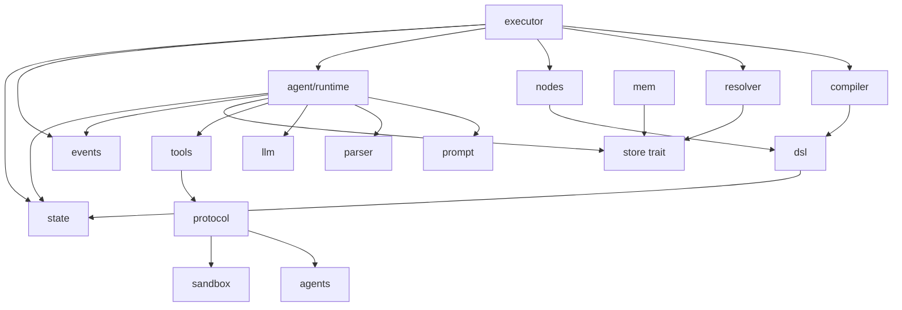

# Module Dependency Graph

Khác với package diagram, file này đi vào dependency bên trong `fa-core`.

## Đọc graph này thế nào

- `executor` là hub runtime.
- `compiler` quyết định flow hợp lệ hay không.
- `resolver` đọc output step từ storage để thay token.
- `nodes` chứa các built-in step.
- `agent/runtime` là đường riêng cho `ai_agent`.
- `tools` là facade cho registry/tool ecosystem.
- `protocol` là lớp chuẩn hoá agent/tool.
- `store trait` là ranh giới giữa core và persistence.
- `mem` cho chạy headless, test hoặc CLI không cần DB.

## Ý nghĩa thiết kế

FlowAgent cố tình không để `executor` biết chi tiết từng tool hay từng agent.
Nó chỉ biết:

- flow đã compile chưa,
- step nào đủ điều kiện chạy,
- step nào đi sang agent runtime,
- và trạng thái nào cần ghi xuống store.

Phần mở rộng AI/tool được đẩy sang `protocol` + `tools` + `agents`.
Nhờ vậy thêm agent mới không đụng vào vòng lặp executor.

