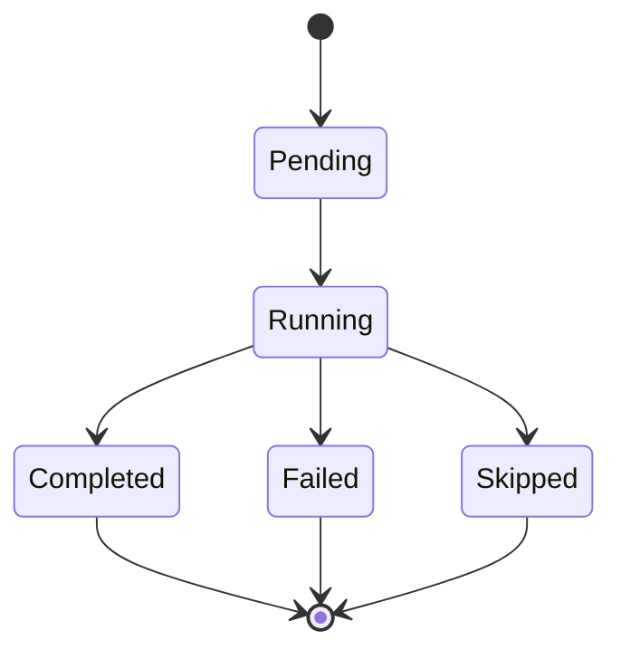
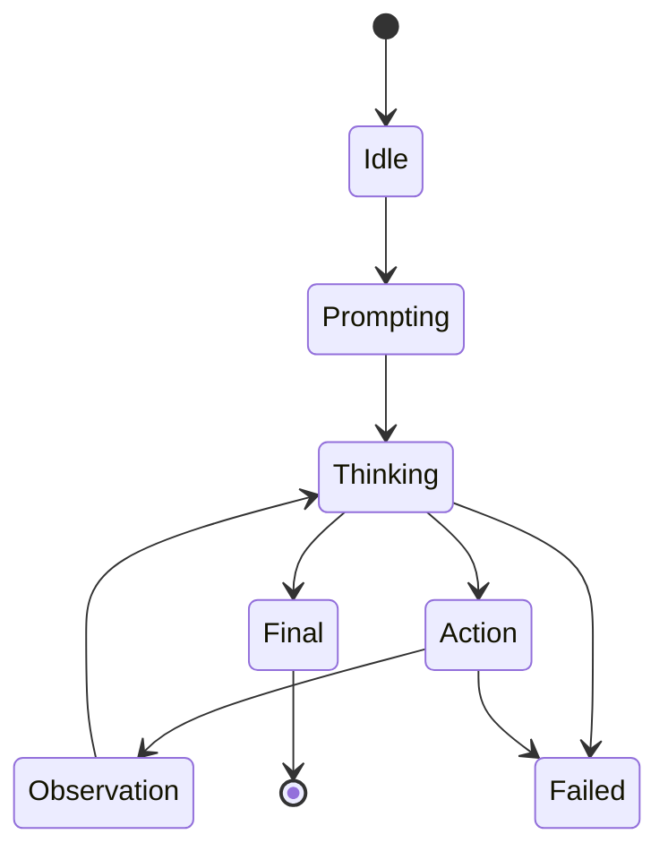
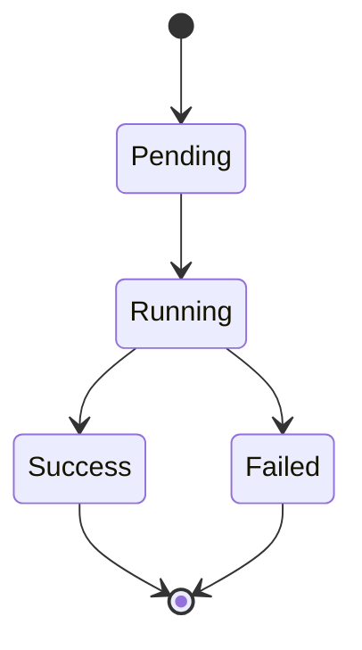

# State Machine

FlowAgent có 3 state machine cần nhìn riêng:

- step,
- agent runtime,
- workflow run.

## 1) Step state machine

### Ý nghĩa

- `Pending`: step đã được tạo record nhưng chưa chạy.
- `Running`: step đang xử lý.
- `Completed`: step xong và có `outputs`.
- `Failed`: step lỗi runtime.
- `Skipped`: step không được chạy vì dependency phía trước fail hoặc không completed.

`Skipped` là trạng thái suy ra từ DAG, không phải lỗi riêng của step.

## 2) Agent runtime state machine

### Ý nghĩa

- `Idle`: node chưa bắt đầu.
- `Prompting`: build system prompt + user prompt + tool schemas.
- `Thinking`: chờ LLM trả về Thought/Action/Final.
- `Action`: model yêu cầu gọi tool.
- `Observation`: kết quả tool được nối lại history.
- `Final`: agent hoàn tất.
- `Failed`: LLM lỗi, parse lỗi nghiêm trọng, hoặc chạm `max_iterations`.

Trong code hiện tại, các trạng thái này là **khái niệm runtime**.
Persisted state chính thức vẫn là `StepStatus`.

## 3) Workflow run state machine

### Ý nghĩa

- `Pending`: run vừa tạo.
- `Running`: executor đang chạy DAG.
- `Success`: mọi step đều completed.
- `Failed`: có ít nhất một step failed.

## Lưu ý kiến trúc

- FlowAgent tách state machine theo tầng.
- Step state là tầng persistence.
- Agent state là tầng runtime nội bộ.
- Workflow state là tầng điều phối tổng.

Đây là điểm đáng giá nhất của thiết kế:

- debug từng bước,
- debug từng vòng ReAct,
- và debug toàn bộ run.

