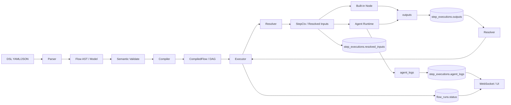

# Data Flow Diagram

File này mô tả data đi qua hệ thống như thế nào.

## Data thật sự được lưu ở đâu

- `flows.dsl_script`: bản DSL gốc.
- `flow_runs.initial_inputs`: payload lúc trigger.
- `step_executions.resolved_inputs`: input sau resolve token.
- `step_executions.outputs`: output của step.
- `step_executions.agent_logs`: log ReAct theo iteration.
- `flow_runs.status` và `step_executions.status`: trạng thái điều phối.

## Khác gì execution flow

`Execution flow` trả lời câu hỏi:

- "bước nào chạy trước?"

`Data flow` trả lời câu hỏi:

- "artifact nào được tạo ra, lưu ở đâu, và được đọc lại thế nào?"

## Điểm mạnh của mô hình này

- Debug dễ hơn vì dữ liệu chạy qua DB.
- Re-render UI dễ hơn vì FE đọc trực tiếp run/step records.
- Replay và audit dễ hơn vì trạng thái không chỉ sống trong RAM.

## Trade-off

- Nhiều I/O hơn.
- Cần schema versioning cẩn thận.
- Cần rõ ràng chuyện snapshot / migration nếu DSL evolve.

