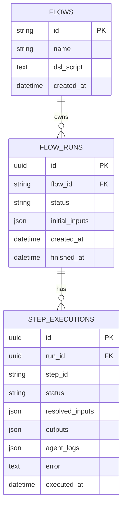

# ER Diagram

FlowAgent hiện có 3 bảng lõi.

## Quan hệ chính

- Một `flow` có nhiều `flow_runs`.
- Một `flow_run` có nhiều `step_executions`.
- `step_executions` có unique `(run_id, step_id)`.

## Vì sao unique `(run_id, step_id)` quan trọng

- Resolver lookup rất nhanh.
- Mỗi step chỉ có một record per run.
- Không bị trộn nhiều attempt vào cùng một dòng dữ liệu.

## Ghi chú về backend

- PostgreSQL dùng `UUID` + `JSONB`.
- MariaDB dùng `CHAR(36)` + `JSON`.
- Logical model vẫn giống nhau.

## Diễn giải thiết kế

ER này cho thấy FlowAgent thiên về auditability:

- DSL được lưu nguyên văn,
- run và step được version hóa theo thời gian,
- log agent được vật hóa trong một JSON array,
- và UI có thể dựng timeline từ dữ liệu thật trong DB.

