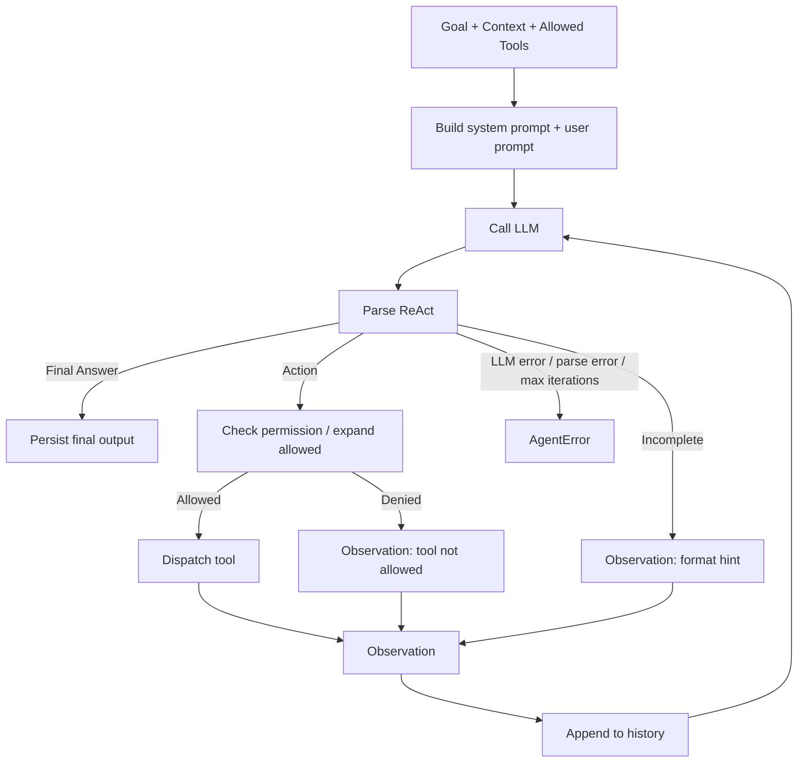

# AI Agent Lifecycle

Đây là lifecycle của riêng `ai_agent`.

## Vòng đời thực tế trong code

1. `prompt::init_history(...)`
   - Tạo system prompt và user prompt.
   - Nhúng schema của các tool đã allowed.

2. `llm::chat(...)`
   - Gọi endpoint chat completions tương thích OpenAI.
   - Dùng `LLM_BASE_URL` và `LLM_API_KEY`.

3. `parser::parse_react(...)`
   - Tách `Thought`, `Action`, `Action Input`, `Final Answer`.
   - Parser bao dung với text-format ReAct.

4. `tools::expand_allowed(...)`
   - Cho phép `allowed_tools` chứa cả tool name lẫn agent id.
   - Ví dụ `pdf` mở ra `pdf_extract_text`, `pdf_metadata`, `pdf_search`.

5. `tools::dispatch(...)`
   - Chỉ gọi tool nằm trong whitelist đã khai triển.
   - Tool output được đổi thành Observation text để nối lại history.

6. `agent_logs`
   - Thought / Action / Observation / Final đều được append vào DB.
   - Đồng thời được phát qua `RunEvent` cho UI realtime.

## Những điểm failure chính

- `max_iterations == 0`: reject ngay.
- LLM HTTP error: `AgentError::Llm`.
- Parse ra format không hợp lệ: push hint observation và tiếp tục.
- Tool bị deny: push observation lỗi và tiếp tục.
- Tool lỗi: cũng trở thành observation để model tự sửa.
- Chạm trần iteration: `AgentError::MaxIterations`.

## Nhận xét

Lifecycle này không phải "gọi LLM một lần".
Nó là một vòng lặp điều phối có quan sát, trong đó:

- model suy nghĩ,
- tool tạo tác động thật,
- observation quay lại prompt,
- và DB giữ vết toàn bộ tiến trình.

