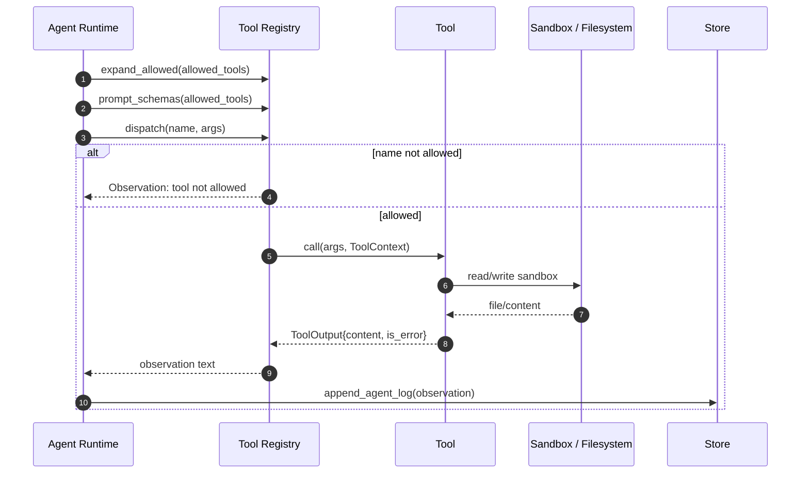

# Tool Calling Flow

File này chỉ tập trung vào đường đi của tool call.

## Luồng quyền hạn

- `allowed_tools` là whitelist ở cấp step.
- `Registry` có thể khai triển `agent id` thành nhiều tool cụ thể.
- Nếu tool name không nằm trong whitelist sau khi khai triển, hệ thống không crash.
- Thay vào đó nó trả Observation lỗi để model tự điều chỉnh.

## ToolOutput được dùng thế nào

`ToolOutput` không đưa thẳng cho model dưới dạng binary object.
Nó được chuyển thành observation text:

- `Text` -> nội dung phản hồi.
- `Resource` -> URI của file trong sandbox.
- `is_error` -> prefix lỗi để model hiểu cần sửa hành động.

## Vì sao sandbox là bắt buộc

- `local_file_writer` ghi file thật.
- `chart` tạo SVG thật.
- `pdf` đọc file thật.
- `scraper` đọc dữ liệu từ URL.

Nếu không có sandbox:

- agent có thể ghi ra ngoài vùng cho phép,
- hoặc tool ghi file sẽ khó kiểm soát.

## Kết luận

Tool calling trong FlowAgent là:

- registry-driven,
- permission-gated,
- sandboxed,
- và có thể mở rộng thành agent packs.

Đây là chỗ FlowAgent khác workflow engine thuần.

