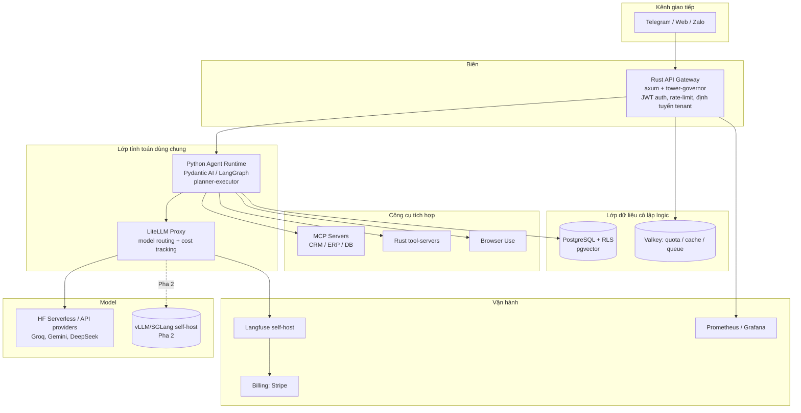

# Báo cáo: Tổ hợp công nghệ & kiến trúc để bán/triển khai giải pháp AI Agent cho doanh nghiệp (B2B)

> Tài liệu dành cho developer. Tổng hợp từ `ai_auto_flow.md`, `ai_agent_b2b.md`, `ai_impl.md`.

---

## Tóm tắt điều hành

Dùng cho cá nhân, OpenClaw (hoặc Goose, Hermes) là đủ. Đem bán cho nhiều doanh nghiệp nhỏ (SME) là bài toán khác về bản chất: đa thuê, cô lập dữ liệu, quản trị chi phí token, tích hợp hệ thống khách, và license sạch để bán lại. Báo cáo đề xuất một platform **Hybrid multi-tenant**: lõi gateway/tool-server viết bằng **Rust**, agent/RAG bằng **Python**, dữ liệu gom về một **PostgreSQL + pgvector** với Row-Level Security, model đi qua **LiteLLM** (đổi provider tự do), giám sát bằng **Langfuse**. Triển khai theo hai pha: demo trên VPS CPU giá rẻ + Hugging Face free/API (không GPU) trước, self-host GPU chỉ khi vượt điểm hòa vốn.

---

## Bảng tra nhanh tổ hợp công nghệ

| Lớp | Pha 0 — Demo (VPS CPU, không GPU) | Pha 2 — Production |
|---|---|---|
| Kênh | Telegram bot | + Web widget, Zalo OA, Slack/Teams |
| Gateway | Rust `axum` + JWT + rate-limit | + WAF, multi-node, autoscale |
| Model routing | LiteLLM proxy | LiteLLM + hybrid routing |
| LLM | HF serverless free / Groq / Gemini Flash / DeepSeek | + vLLM/SGLang self-host trên GPU thuê |
| Embeddings | `fastembed` + bge-m3/e5-small (CPU) | + GPU embedding nếu volume lớn |
| Vector + DB | PostgreSQL + pgvector (một DB) | + pgvectorscale, hoặc tách Qdrant |
| Agent | Pydantic AI, planner-executor, single-agent + RAG | + multi-agent khi thật cần |
| Tích hợp | 1-2 MCP server | Nhiều MCP + Rust tool-servers |
| Cache/Queue | Valkey | Valkey cluster |
| Observability | Langfuse self-host | + Prometheus/Grafana, alerting |
| Billing | Log usage → thủ công | Stripe usage-based từ Langfuse Metrics API |
| Bảo mật | Auth + HITL + scoped tokens | + chống prompt injection, audit đầy đủ |

---

# PHẦN I — BÁO CÁO CHÍNH

## 1. Vấn đề & phạm vi

Dùng cá nhân: OpenClaw chạy local, một người, bộ nhớ file Markdown, cấp quyền hệ thống thoải mái — đủ. Bán cho nhiều SME phải giải đồng thời: nhiều khách chạy song song, cô lập dữ liệu từng khách, quản trị ngân sách token, tích hợp CRM/ERP của khách, và tránh rủi ro pháp lý license. Đây là lý do **không thể "đóng gói OpenClaw đem bán"**.

## 2. Yêu cầu đã chốt

- **Ngôn ngữ**: Rust cho gateway/concurrency/tool-server; Python cho agent/RAG/inference.
- **Hạ tầng đầu**: VPS CPU giá rẻ, không GPU riêng; LLM từ API/HF serverless.
- **Database riêng**: tự host PostgreSQL.
- **Model hosting**: Hugging Face free giai đoạn đầu → self-host GPU khi scale.
- **Đối tượng đọc**: developer. **Chiến lược**: demo trước, chuyên nghiệp sau.

## 3. Khoảng cách khả thi: vì sao OpenClaw không bán được

| Yếu tố B2B bắt buộc | OpenClaw / trợ lý cá nhân | Cần cho platform B2B |
|---|---|---|
| Đa thuê | Không | `tenant_id` + cô lập cứng |
| Cô lập dữ liệu khách | Không (file local) | PostgreSQL RLS |
| Quản trị chi phí/quota | Không | Rate-limit + budget theo tenant |
| Audit & tuân thủ | Sơ khai | Log truy vết theo danh tính người |
| Tích hợp hệ thống khách | Thủ công | Chuẩn hóa qua MCP |
| License thương mại | N/A | Phải "sạch" để bán lại |

## 4. Ràng buộc license (sàng lọc trước khi chọn công nghệ)

| Thành phần | License | Bán lại dạng SaaS? |
|---|---|---|
| n8n | Sustainable Use License | ❌ Cấm nhúng làm SaaS backend cho khách ngoài nếu không mua license (rất đắt) |
| Dify | Apache 2.0 + hạn chế | ⚠️ Cấm làm cloud cạnh tranh; từng có CVE rò rỉ dữ liệu chéo |
| FastGPT | Hạn chế | ❌ Cấm SaaS không trả phí |
| Flowise | MIT | ✅ |
| ActivePieces (core) | MIT | ✅ |
| LiteLLM | MIT | ✅ |
| Qdrant | Apache 2.0 | ✅ |
| pgvector / pgvectorscale | PostgreSQL License | ✅ |
| Langfuse (core) | MIT (EE riêng) | ✅ tự host core |
| Redis | RSALv2/SSPL (từ 7.4) | ⚠️ → dùng Valkey (BSD) |
| axum/tokio/tower | MIT | ✅ |
| Pydantic AI / LangGraph / CrewAI | MIT | ✅ |

**Khuyến nghị**: tự viết lõi orchestration bằng Rust thay vì nhúng n8n/Dify/FastGPT làm engine thương mại — vừa sạch license, vừa đúng định hướng ngôn ngữ.

## 5. Kiến trúc tổng thể (Hybrid multi-tenant)

**Nguyên tắc**: tính toán dùng chung (tiết kiệm VPS) + dữ liệu cô lập logic bằng PostgreSQL RLS (mỗi bản ghi gắn `tenant_id`, DB tự chối truy vấn sai tenant kể cả khi code lỗi). Khách lớn/ngành nhạy cảm sau này nâng lên Single-Tenant VPC riêng.

## 6. Ranh giới Rust ↔ Python

| Thành phần | Ngôn ngữ | Thư viện chính |
|---|---|---|
| API Gateway, auth, tenant routing | Rust | `axum`, `tower`, `tower-governor`, `jsonwebtoken` |
| Quota/rate-limit (sliding window + token bucket) | Rust | `deadpool-redis` (Valkey) |
| Webhook ingestion | Rust | `axum`, `reqwest` |
| DB/migrations phía Rust | Rust | `sqlx` / `SeaORM` |
| Tool-server hiệu năng cao | Rust | `axum`/`tonic` (gRPC) |
| Agent runtime (planner-executor, tool-calling) | Python | `pydantic-ai` / `langgraph` |
| Model routing + cost tracking | Python (service) | `litellm` |
| RAG + embeddings | Python | `fastembed`, `qdrant-client`/`psycopg` |
| Observability | self-host | `langfuse` |

**Giao tiếp Rust ↔ Python**: Gateway (Rust) gọi Agent Runtime (Python/FastAPI) qua HTTP nội bộ hoặc hàng đợi (Valkey/NATS).

**Bảo mật bắt buộc từ ngày đầu**: Gateway phải có auth trước khi mở ra Internet — đừng để endpoint agent chạy không xác thực (nó gọi được tool + đốt token của bạn).

## 7. Tổ hợp công nghệ đề xuất

Xem **"Bảng tra nhanh"** ở đầu tài liệu — đó là câu trả lời gọn cho "cần những tổ hợp công nghệ nào".

## 8. Phân tích khả thi & tính ứng dụng thực

**Chi phí**: quy mô nhỏ (<~100 user, <5M token/ngày) → API rẻ hơn tự host rõ rệt; demo gần như 0đ model (HF free/free tier) + vài đô VPS. Điểm hòa vốn tự-host GPU: ~2-5M token/ngày so với tier GPT-4; so với API model mở (DeepSeek/Together) phải ~50M token/ngày → SME ở trên API rất lâu.

**Đúng/sai trong giả định:**

- ✅ Không cần GPU riêng cho demo/giai đoạn đầu.
- ✅ VPS rẻ đủ chạy app + Postgres + pgvector + embeddings nhỏ.
- ⚠️ VPS CPU **không** chạy LLM 7B+ ở tốc độ dùng được → LLM đến từ API.
- ⚠️ HF free là để thử/demo (rate-limit, cold-start), không cam kết SLA cho khách trên tier này.

**Use-case bán được nhất cho SME**: hỗ trợ khách/chatbot đặt lịch, RAG tra cứu tài liệu nội bộ, đánh giá/nuôi lead, OCR hóa đơn. SME sẵn trả $50-500/tháng (hoặc $5k-30k bản tùy biến).

**Rủi ro & giảm thiểu**: rò rỉ chéo (→ RLS + test cô lập), prompt injection (→ HITL + quét đầu vào + scoped tokens), license (→ tránh n8n/Dify/FastGPT làm lõi), lock-in provider (→ LiteLLM).

## 9. Lộ trình 9 task (demo được từng bước)

1. **Khung xương end-to-end (single-tenant)**: Rust gateway (axum, JWT) → Python agent (FastAPI + Pydantic AI) → LiteLLM → HF free/Groq; Postgres cơ bản. *Test*: integration gửi prompt → nhận phản hồi. *Demo*: hỏi 1 câu qua API/Telegram, agent trả lời qua đúng chuỗi.
2. **RAG trên database riêng**: bật pgvector, ingest tài liệu, embeddings `fastembed`+bge-m3, truy hồi. *Test*: retrieval trả đúng chunk. *Demo*: upload PDF, hỏi và nhận câu trả lời trích từ tài liệu.
3. **Đa thuê + cô lập**: `tenant_id`, PostgreSQL RLS, API key theo tenant. *Test*: tenant A không đọc được B. *Demo*: 2 tenant tách bạch.
4. **Quota & ngân sách**: Valkey + rate-limit (sliding window RPM, token bucket TPM) ở Rust; budget theo tenant trên LiteLLM. *Test*: vượt ngưỡng → 429/403. *Demo*: tenant bị chặn khi hết quota.
5. **Observability & cost**: Langfuse self-host + callback LiteLLM, gắn `trace_user_id`/`session_id`. *Test*: mỗi request tạo trace kèm token/cost. *Demo*: dashboard token & USD theo tenant.
6. **Tích hợp MCP + HITL**: một MCP server (DB/CRM), chốt phê duyệt cho hành động ghi/gửi. *Test*: hành động đổi trạng thái bị chặn tới khi duyệt. *Demo*: agent đề xuất cập nhật CRM, chờ duyệt mới thực thi.
7. **Kênh Telegram hoàn chỉnh**: webhook ingestion (Rust) + định tuyến tenant. *Test*: webhook → agent → phản hồi đúng tenant. *Demo*: một SME dùng trọn luồng.
8. **Billing theo usage**: rút Langfuse Metrics API → hóa đơn Stripe usage-based. *Test*: usage tháng → hóa đơn khớp. *Demo*: sinh hóa đơn tháng.
9. **Đường scale (Pha 2)**: container hóa; thêm self-host vLLM/SGLang + hybrid routing; Terraform cho Single-Tenant VPC premium. *Test*: đổi tenant sang model tự-host không sửa app. *Demo*: một tenant chạy model mở self-hosted, tenant khác vẫn dùng API.

## 10. Khuyến nghị then chốt

Tự viết lõi orchestration + gateway bằng **Rust** ghép với agent worker **Python** (Pydantic AI). Dữ liệu gom về một **PostgreSQL + pgvector**. **LiteLLM** để hoán đổi model, **Langfuse** để đo chi phí, **Valkey** thay Redis. Demo chạy HF free/API + VPS CPU, không GPU; chỉ tự-host GPU khi token/ngày vượt điểm hòa vốn.

---

# PHẦN II — PHỤ LỤC ĐÁNH ĐỔI

## A. Ranh giới Rust ↔ Python — 3 kịch bản

| Kịch bản | Rust làm gì | Python làm gì | Khi nào chọn |
|---|---|---|---|
| Python-first | (chưa có) | Tất cả | Validate nhu cầu cực nhanh |
| Hybrid (đã chốt) | Gateway, quota, webhook, tool-server nặng | Agent, RAG, LiteLLM | Mặc định |
| Rust-maximal | + RAG (`swiftide`), gọi model (`async-openai`), agent loop (`rig`) | Chỉ phần buộc phải | Thích Rust, chấp nhận đi chậm, muốn 1 binary |

Hệ agent Rust tồn tại nhưng non hơn Python: `rig`, `swiftide`, `kalosm`, `llm-chain`, `async-openai`, `fastembed`. Chỗ đuối nhất là orchestration phức tạp (planner-executor nhiều bước, HITL checkpoint).

## B. Orchestration: tự viết vs OSS vs durable engine

- **Tự viết Rust**: sạch license, kiểm soát; phải tự làm retry/resume/scheduling.
- **Flowise/ActivePieces (MIT)**: có UI builder, nhưng lệch stack (Node/TS), thêm hệ để nuôi.
- **Temporal**: durable execution mạnh cho workflow dài/HITL gián đoạn; nặng cho một người ở Pha 0.
- **Job queue đơn giản (Postgres/Valkey)**: đủ cho MVP.

**Nghiêng**: Pha 0-1 tự viết lõi + job queue đơn giản. Temporal ở Pha 2 khi cần. Chỉ dùng ActivePieces nếu sản phẩm chính là "workflow builder cho SME".

## C. Vector DB: pgvector vs Qdrant

| | pgvector (+scale) | Qdrant |
|---|---|---|
| Service phải nuôi | 0 thêm | +1 |
| Backup | Chung Postgres | Riêng |
| Cô lập tenant | RLS "miễn phí" | Payload filter (dễ quên → rò rỉ) hoặc collection-per-tenant |
| Quy mô ngọt | ~10-100M vector | ~50M+, có quantization |
| Hợp "DB riêng" | ✅ đúng nhất | DB riêng cho vector |
| Hợp "ưu tiên Rust" | Trung lập | ✅ Rust |

**Nghiêng**: bắt đầu pgvector (một DB, RLS an toàn hơn ở điểm cô lập). Chuyển/bổ sung Qdrant khi vector là workload chính, cần quantization, hoặc muốn tận dụng Rust.

## D. Framework agent

| Lựa chọn | Mạnh | Yếu | Hợp khi |
|---|---|---|---|
| Pydantic AI | Typed, gọn, ít "phép thuật" | Mới | MVP single-agent + tool + RAG |
| LangGraph | State machine, checkpoint/HITL bền | Kéo theo LangChain | Workflow nhiều bước, dừng chờ duyệt |
| CrewAI | Multi-agent theo vai trò | Nặng, learning curve | Khi thật cần nhiều agent |
| Tự viết loop | Kiểm soát tối đa | Tự làm mọi thứ | Muốn tối ưu token |

**Nghiêng**: Pydantic AI hoặc tự viết loop cho MVP theo mẫu planner-executor. Tránh multi-agent tới khi có bài toán thực sự cần.

## E. Multi-tenancy: RLS vs schema vs DB-per-tenant

| Mô hình | Cô lập | Ops | Gotcha |
|---|---|---|---|
| Shared + RLS | Tốt (DB tự chặn) | Thấp nhất | Phải set tenant context mỗi transaction |
| Schema-per-tenant | Tốt hơn | Trung bình | Migration nhân lên |
| DB-per-tenant/VPC | Tuyệt đối | Cao | CI/CD provisioning phức tạp |

**Gotcha PgBouncer transaction pooling**: không dùng `SET` session-level (connection bị dùng lại cho tenant khác → rò rỉ). Phải `SET LOCAL app.current_tenant = $1` trong cùng transaction. Bọc thành middleware để không ai quên.

**Nghiêng**: Shared + RLS cho Pha 0-1; DB-per-tenant/VPC làm gói premium.

## F. Chọn LLM provider + data residency

| Provider | Ưu | Nhược / rủi ro |
|---|---|---|
| Groq | Cực nhanh, free tier | Ít model, rate-limit |
| Gemini Flash | Free tier rộng, tiếng Việt ổn | Dữ liệu qua Google; đọc kỹ điều khoản free |
| DeepSeek | Rẻ, chất lượng cao | Dữ liệu về máy chủ TQ — nhiều khách sẽ từ chối |
| OpenRouter | Gộp nhiều model, đổi dễ | Thêm hop, phụ thuộc ToS |
| OpenAI/Anthropic | Tin cậy, tiếng Việt tốt | Không free, đắt hơn |
| HF Serverless | Free | Rate-limit, cold-start, không SLA |

**Phân vân cốt lõi B2B**: dữ liệu khách chạy qua đâu? Đây là chuyện bán được hay không. LiteLLM cho phép hoán đổi provider theo yêu cầu từng khách, và tiến tới self-host cho khách nhạy cảm.

**Nghiêng**: demo dùng Gemini Flash/Groq; DeepSeek cho khách không nhạy cảm; chuẩn bị self-host cho khách yêu cầu chủ quyền dữ liệu.

## G. Tiếng Việt: model & embeddings

- **LLM tiếng Việt tốt**: Gemini, GPT-4o, Claude (đóng); mở: Qwen2.5, Llama 3.x, fine-tune Việt (Vistral, PhoGPT, VinaLlama — cần thử thực tế).
- **Embeddings đa ngữ**: bge-m3 (mạnh, ~560M, nặng CPU), multilingual-e5 (nhẹ hơn), hoặc API (OpenAI/Voyage/Jina/Cohere).
- **Gotcha CPU**: bge-m3 chậm khi ingest lớn → demo dùng e5-small/bge-small, nâng lên bge-m3 khi cần chất lượng. Chunking/dấu tiếng Việt ảnh hưởng recall.

## H. Hugging Face: 4 cách dùng

1. **Serverless Inference API** (free/rate-limited): demo nhẹ, không SLA.
2. **Inference Endpoints** (GPU managed, trả theo giờ, scale-to-zero): bước đệm production.
3. **Spaces** (host app demo; ZeroGPU): show POC, không phải backend production.
4. **Models Hub** (tải weights): lấy Llama/Qwen/Mistral chạy trên vLLM/SGLang (Pha 2).

## I. Mô hình chi phí + ví dụ (số gần đúng, cần kiểm chứng)

- **VPS**: Hetzner CPX21/31 (~€8-15/tháng) hoặc ARM CAX; Contabo rẻ hơn (oversubscribe); DO/Linode ~$12-24. Một VPS 4 vCPU/8-16GB chạy được gateway+agent+Postgres+Valkey+embeddings nhỏ+Langfuse.
- **GPU thuê**: Runpod A100 80GB ~$1.2-2/h, H100 ~$2-4/h; Vast.ai spot rẻ hơn. 1×A100 24/7 ≈ $1.500-2.000/tháng.

**Ví dụ** 10 khách SME, mỗi khách ~200 hội thoại/ngày × ~6.000 token = 1,2M/khách → ~12M token/ngày:

- Model nhỏ (Gemini Flash/GPT-4o-mini, ~$0,2-0,4/1M): ~$100-150/tháng cho cả 10 khách.
- GPT-4o (~$5/1M blended): ~$1.800/tháng.
- Tự host 1×A100: ~$1.500-2.000/tháng cố định.

**Bài học**: model nhỏ qua API rẻ hơn nhiều; tự host chỉ thắng khi buộc dùng model lớn ở volume cao hoặc vì lý do dữ liệu. Hybrid routing tiết kiệm nhất.

## J. Durable execution & độ tin cậy

Agent gọi tool/chờ API, có thể chết giữa chừng. Cần retry có backoff, idempotency key (đừng gửi email 2 lần), resume. Pha 0-1: bảng `jobs` (status/attempts/payload) hoặc Valkey stream. Pha 2: Temporal/Restate. Hành động không đảo ngược phải qua HITL + idempotency.

## K. Bảo mật đào sâu

- **K.1 Indirect Prompt Injection (rủi ro số 1)**: lệnh ẩn trong tài liệu/email/web agent đọc. Giảm thiểu: coi nội dung ngoài là dữ liệu không phải lệnh; không cho RAG kích hoạt tool chưa qua guardrail; quét đầu vào (`llm-guard`, Rebuff, Lakera, Model Armor) ở biên; allowlist tool theo ngữ cảnh; lọc đầu ra chống rò rỉ.
- **K.2 Confused Deputy**: MCP quyền cao + user quyền thấp. Giảm thiểu: truyền user context xuống tool, kiểm tra quyền trước khi gọi, least-privilege scoped tokens.
- **K.3 Audit Blind Spots**: tự dựng audit log nối chuỗi người → phiên agent → tool → kết quả; Langfuse giữ reasoning trace.
- **K.4 Token passthrough**: không chuyển thẳng token gốc; dùng token ngắn hạn, giới hạn audience/scope.
- **K.5 Secrets & credential khách**: `.env` → Infisical/Vault/Doppler; credential khách mã hóa at-rest (KMS/age/libsodium), không log/không đưa vào prompt. Ghim version, cảnh giác typosquatting.
- **K.6 Chặn "cháy token"**: max steps/run, max tokens/run, timeout, circuit breaker.
- **K.7 Test cô lập tenant** như hạng mục bắt buộc (Postgres + vector).
- **K.8 PII & retention**: xóa log/trace sau X ngày, redaction PII, hỗ trợ quyền xóa; self-host Langfuse.
- **K.9 Mạng**: auth từ ngày đầu, TLS, không endpoint agent không xác thực.

## L. Observability & Eval

| Công cụ | Mạnh | Ghi chú |
|---|---|---|
| Langfuse (chọn) | Trace + token/cost theo tenant, self-host, Metrics API cho billing | Ghép LiteLLM callback |
| Phoenix (Arize) | Eval + tracing OSS | Bổ sung đo chất lượng |
| Helicone | Proxy-based, cắm nhanh | Ít kiểm soát self-host |
| OpenLLMetry | Chuẩn OpenTelemetry | Nếu đã dùng OTel |
| Langsmith | Tốt cho LangChain | Hosted, không OSS |

**Eval**: một bộ đánh giá nhỏ mỗi use-case (Langfuse/Phoenix datasets, `ragas` cho RAG) để dám đổi sang model rẻ mà không sợ tụt chất lượng. Hạ tầng: Prometheus + Grafana; log stdout→file sớm, Loki sau.

## M. Triển khai & vận hành cho một người

**Nguyên tắc**: ít bộ phận chuyển động nhất.

- **Pha 0-1**: Docker Compose trên một VPS + Caddy (auto-TLS). Backup `pg_dump` cron → Backblaze B2/S3, test restore. Secrets `.env`→Infisical/Doppler. Uptime Kuma, Grafana. CI/CD GitHub Actions → deploy bằng Kamal hoặc `compose pull`. Migrations trong bước deploy.
- **Pha 2**: Nomad (nhẹ) hoặc k8s managed — tránh tự dựng k8s. Một VPS = một điểm chết → thêm backup hằng ngày + standby DB khi có khách trả tiền.

## N. Billing & biên lợi nhuận

Mô hình giá: seat-based / usage-based / outcome-based / freemium+upsell. **Rủi ro biên**: giá phẳng + khách xài nặng = lỗ → bắt buộc quota + overage/throttle; đo COGS/tenant (token từ Langfuse + hạ tầng); hybrid routing kéo COGS xuống. Kỹ thuật: Stripe metered billing từ Langfuse Metrics API. Cho SME: gói phẳng theo tầng + trần usage (dễ bán hơn thuần token).

## O. Build vs Buy tổng thể

| Tình huống | Nên làm |
|---|---|
| Kiểm chứng nhu cầu, pilot nội bộ | OSS có sẵn (kể cả n8n nội bộ, Flowise MIT) |
| Xây sản phẩm để bán | Lõi Rust + Python tự viết |
| Bán "workflow builder cho SME" | Đứng trên ActivePieces (MIT) |
| Routing/observability/DB/auth | Dùng lại (LiteLLM, Langfuse, Postgres/pgvector, thư viện auth) |

Đừng xây lại thứ đã thành hàng hóa; hãy xây điểm khác biệt (automation ngành + tích hợp + UX). **Auth**: JWT tự quản (demo) → Ory (nhẹ) / Keycloak (đầy đủ) khi cần SSO; Clerk/Auth0 nhanh nhưng hosted + phí.

## P. MCP vs ACP

- **MCP**: CÓ dùng — chuẩn hóa connector CRM/ERP/DB, agent tự khám phá tool. Lưu ý rủi ro bảo mật mục K.
- **ACP**: nhiều khả năng KHÔNG cần — ACP là chuẩn editor ↔ coding agent (dùng agent trong IDE). Chỉ liên quan nếu bạn bán coding assistant. Đừng tốn thời gian cho ACP với sản phẩm automation SME.

## Q. Fine-tuning

Giai đoạn đầu gần như KHÔNG. RAG + prompt tốt + few-shot đủ. Fine-tune để "thêm kiến thức" là sai (dùng RAG). Fine-tune có giá trị sau để cố định phong cách/định dạng, hạ chi phí (model nhỏ fine-tuned thắng model lớn ở tác vụ hẹp), tạo switching cost. Công cụ: LoRA với Unsloth/Axolotl trên GPU thuê, weights quản lý trên HF.

## R. Chọn vertical đầu tiên

| Vertical | Stack tinh chỉnh | Vì sao |
|---|---|---|
| ① Hỗ trợ khách + đặt lịch (nhà hàng, phòng khám, bán lẻ) | RAG FAQ/menu, Telegram/Zalo/web, tool lịch, HITL xác nhận | Dễ demo nhất, ROI rõ |
| ② Tra cứu tài liệu nội bộ (luật, tư vấn, sản xuất) | RAG mạnh (bge-m3, chunking, trích dẫn), phân quyền tài liệu | Cân nhắc Qdrant |
| ③ Lead qualification + CRM (bất động sản, dịch vụ B2B) | Intake đa kênh, agent chấm điểm, MCP CRM, HITL trước khi ghi, soạn email | ROI doanh thu |
| ④ OCR hóa đơn → ERP (kế toán) | OCR (PaddleOCR/vision), trích xuất, HITL soát, connector ERP | ROI cao, công build lớn |

**Nghiêng**: bắt đầu ① (nhanh ra bản bán được nhất); ② nếu quan hệ ở mảng luật/tư vấn. Chọn theo nơi bạn có sẵn design partner.

## S. Bẫy thực tế dễ vấp

HF free rate-limit/cold-start làm demo khựng (→ API fallback); tưởng VPS CPU chạy được LLM (không); RLS + PgBouncer phải `SET LOCAL`; quên filter tenant trong vector (Qdrant) → rò rỉ; agent lặp đốt token (→ max-steps + budget); prompt injection từ tài liệu khách upload; "license creep" nhét n8n làm backend cho nhanh; streaming SSE/WebSocket qua Rust gateway (buffering/timeout); chunking/dấu tiếng Việt tụt recall; over-engineer multi-agent/k8s/Temporal quá sớm; backup không test restore; model version drift (→ ghim version + eval set); data residency lòi ra muộn; secret/PII lọt vào prompt/trace.

## T. Câu hỏi mở + cách tự trả lời

- **Vertical nào trước?** → theo nơi có design partner.
- **Kênh nào trước?** → Telegram/Zalo cho SME Việt.
- **pgvector hay Qdrant?** → pgvector trừ khi RAG nặng.
- **Provider + chính sách dữ liệu?** → theo độ nhạy cảm nhóm khách (tài chính/y tế → tránh model TQ, chuẩn bị self-host).
- **Giá?** → gói phẳng theo tầng + trần usage; validate với 2-3 design partner.
- **Khách đầu tiên?** → design partner từ quan hệ, pilot miễn phí → case study.
- **Shared+RLS hay VPC?** → shared+RLS mặc định, VPC premium.

---

**Nguồn tham chiếu nội bộ**: `ai_auto_flow.md` (bức tranh 17 dự án OSS), `ai_agent_b2b.md` (yêu cầu kiến trúc B2B, license, gateway, vector DB, MCP/ACP, bảo mật, deploy), `ai_impl.md` (kiến trúc đa lớp, kinh tế chi phí, workflow, agent, triển khai LLM).
