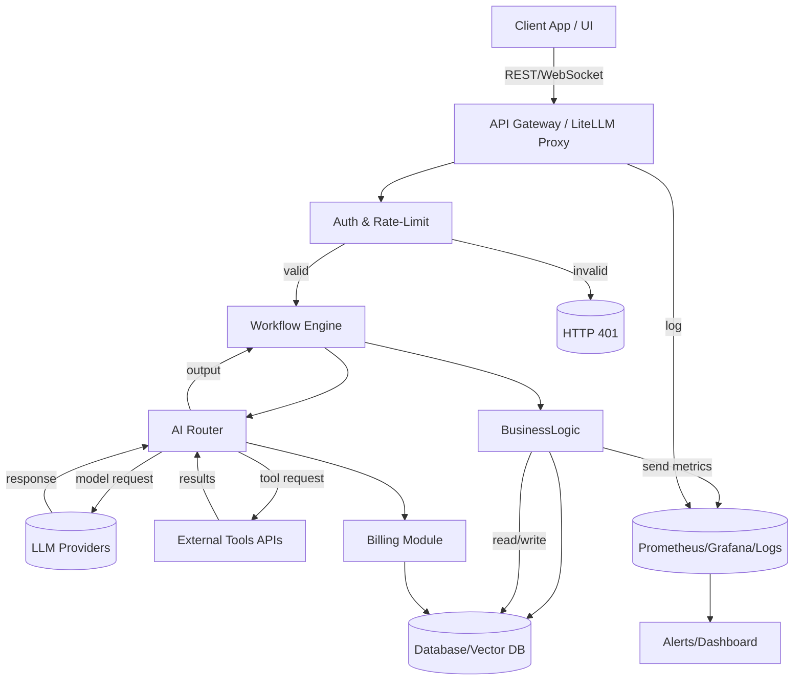

# Báo cáo Chi tiết: Xây dựng Dịch vụ Tự động hóa AI một Người (B2B)  

## Giới thiệu  
Báo cáo này tổng hợp khảo sát toàn diện về hệ sinh thái **AI Automation** hiện tại và thiết kế kiến trúc cho công ty AI một người (solo-founder) nhắm đến các doanh nghiệp nhỏ. Nội dung được tổ chức thành nhiều phần, gồm: so sánh dự án mã nguồn mở, kiến trúc đa lớp, lớp cổng AI, tích hợp kênh giao tiếp, quy trình doanh nghiệp, kiến trúc agent, triển khai LLM, kinh tế ước tính chi phí, nhu cầu khách hàng, chiến lược người sáng lập, sản phẩm, quy trình phát triển, công nghệ đề xuất, quyết định build vs buy, và lộ trình thực tiễn. Mỗi phần đều dựa trên nguồn tham khảo uy tín (tạp chí kỹ thuật, blog lập trình, tài liệu chính thức) và tránh lý thuyết chung chung, tập trung vào giải pháp kỹ thuật thực tiễn và bền vững.  

## 1. Cảnh quan Tự động hóa AI Hiện tại  
Nhiều dự án mã nguồn mở đã xuất hiện, cung cấp nền tảng xây dựng agent và workflow tự động hóa AI. Dưới đây là tổng quan về một số dự án tiêu biểu:

- **OpenClaw**: Là trợ lý AI cá nhân đa kênh, chạy cục bộ trên máy của người dùng. Mục đích chính của OpenClaw là bảo vệ quyền riêng tư và sở hữu dữ liệu. Dự án đang phát triển rất nhanh (170k stars trên GitHub), hỗ trợ chat, voice, tích hợp nhiều agent nội bộ. Ưu điểm của OpenClaw là cài đặt dễ dàng, hoạt động offline, linh hoạt với API của nhiều LLM. Tuy nhiên, nó thiên về người dùng cá nhân; không có sẵn tính năng đa tenant nên để bán cho doanh nghiệp cần bổ sung lớp quản lý riêng. Mức độ trưởng thành cao (nhiều đóng góp cộng đồng) nhưng chi phí duy trì (chạy server) sẽ tăng nếu mở rộng cho nhiều khách hàng. Một cá nhân có thể tự dùng, nhưng khi triển khai cho doanh nghiệp cần đầu tư phát triển thêm tính năng.

- **Hermes Agent**: Dự án mới (ra mắt Q1/2026) do Nous Research phát triển. Là agent mã nguồn mở, chạy trên server của khách hàng, phi tập trung. Hermes hỗ trợ ghi nhớ (memory) và tự tạo kỹ năng, tập trung vào tự động hóa lâu dài (life-long learning). Hỗ trợ nhiều kênh (Telegram, Discord, Slack, WhatsApp, Signal, CLI), cho phép agent hoạt động liên tục. Vì mới ra mắt nên hệ sinh thái chưa đa dạng, nhưng định hướng rất tham vọng. Hermes miễn phí, MIT, nhưng hiện vẫn trong giai đoạn sơ khởi, chưa rõ triển khai quy mô lớn. Một cá nhân hoặc doanh nghiệp nhỏ có thể thử dùng cho nhu cầu cá nhân hoặc hội nhóm nhỏ, nhưng để phục vụ hàng trăm khách hàng cần thời gian phát triển thêm cho quản lý multi-user.

- **OpenHands (All-Hands-AI)**: Dự án tập trung vào tự động hóa nhiệm vụ phát triển phần mềm (code review, fix lỗi, triaging bug). Họ cung cấp cả phiên bản mã nguồn mở và dịch vụ doanh nghiệp. OpenHands đã được đầu tư lớn (~18.8 triệu USD) và có đối tác lớn (Oracle, etc). Ưu điểm: giải pháp rất mạnh về dev workflow, tích hợp đa tác vụ, cơ chế RBAC, SSO cho doanh nghiệp. Điểm yếu: phức tạp, chuyên về kỹ thuật phần mềm, không thiên về tự động hóa văn phòng chung. Chi phí duy trì cao; để chạy dịch vụ cần cơ sở hạ tầng mạnh. Không phù hợp cho một lập trình viên bán giải pháp cho doanh nghiệp nhỏ, trừ khi khách hàng là công ty công nghệ. Với solo, chỉ hợp tác nếu có khách hàng đặc thù trong mảng dev.

- **OpenManus**: Dự án mã nguồn mở với ý tưởng giống trợ lý kỹ sư (engineering assistant). Ít thông tin công bố, xuất phát từ cộng đồng AI (mô phỏng GPTManus). Ưu: đơn giản, cho phép cá nhân tùy chỉnh kỹ năng. Nhược: cộng đồng nhỏ, thiếu tính năng doanh nghiệp. Có thể dùng thử cho mục đích demo, nhưng chưa có bằng chứng triển khai doanh nghiệp. 

- **n8n**: Là nền tảng tự động hóa workflow đa năng (như Zapier) mã nguồn mở, Apache 2.0. Phát triển từ 2019, có cộng đồng lớn. Điểm mạnh: đa tác vụ, đa nguồn tích hợp (400+ connectors), có UI kéo-thả. Nhược: không multi-tenant sẵn, license *Sustainable Use* hạn chế nhúng dịch vụ, cần trả phí enterprise nếu muốn tích hợp vào sản phẩm. Thường dùng cho tự động hóa nội bộ, phù hợp công ty nhỏ hoặc một người tự dùng để tích hợp công cụ. Không tối ưu cho xây dựng sản phẩm SaaS cho nhiều khách. Chi phí duy trì chủ yếu từ tài nguyên máy chủ; một lập trình viên có thể tự host hoặc dùng cloud (có gói trả phí).

- **ActivePieces**: Nền tảng workflow mã nguồn mở mới (ra 2023), MIT. Giao diện đẹp, 150+ tích hợp, code TypeScript (khác n8n Python/JS). Đơn giản, dễ deploy (Docker). Phù hợp cho người mới, hỗ trợ multi-worker. Nhược: còn non trẻ, ít tích hợp hơn n8n, cũng không multi-tenant mặc định. Đang có gói Enterprise (Cloud hoặc On-Prem). Với công ty nhỏ, ActivePieces dùng tốt cho các workflow riêng; solo founder có thể tự host. Để bán dịch vụ, cần phát triển thêm lớp quản lý đa khách nếu cần.

- **Flowise.ai**: Nền tảng đồ hoạ (visual) cho xây dựng agent và pipeline RAG, tích hợp LangChain. Được Workday mua lại, hướng enterprise, hỗ trợ nhiều LLM, observability, Human-in-the-loop. Mã nguồn mở (Apache 2.0), nhưng có bản enterprise. Mạnh ở UI, lập trình agent phức tạp. Nhược: do chuyên doanh nghiệp, có thể nặng nề, và quyền kiểm soát bản OSS chưa rõ mức độ. Dùng cho solo cần kỹ năng dev UI và tài nguyên máy chủ. Có thể dùng một người phát triển POC, nhưng nhiều khách hàng cần tuỳ biến lớn.

- **Langflow**: Công cụ Python, MIT, giao diện đồ hoạ, tùy chỉnh lưu đồ cho LangChain. Có hơn 100k sao trên GitHub, rất phổ biến. Giúp người dùng tạo và visual hoá pipeline AI, tích hợp mô-đun (tools, RAG) linh hoạt. Điểm mạnh: cộng đồng lớn, dễ tích hợp mã Python, support multi-agent flows. Nhược: không native hỗ trợ multi-tenant hay cổng, chủ yếu là công cụ developer. Solo dev có thể dùng làm nền tảng phát triển. Bán SaaS cần thêm khung quản lý người dùng, tuy không quá khó.

- **Dify.ai**: Nền tảng phát triển ứng dụng LLM mã nguồn mở (Front-End + Back-End). Cung cấp GUI, pipeline RAG, agent, quản lý mô hình, giám sát. MIT license, có dịch vụ đám mây. Mục đích: từ prototype đến production. Mạnh ở tốc độ xây dựng demo. Yếu: chưa phổ biến bằng Langflow, tài liệu chưa đủ. Với một người dev, Dify giúp tạo sản phẩm nhanh. Tuy nhiên, tương tự Flowise, cần tuỳ biến để chạy SaaS.

- **FastGPT**: Framework tạo AI agent (tương tác workspace) mã nguồn mở. Hỗ trợ visualization workflows. Nhiều sao (28k). Quan trọng: giấy phép hạn chế – *không được dùng dưới dạng SaaS mà không mua giấy phép*. Nếu bạn là solo founder muốn bán dịch vụ SaaS, cần mua giấy phép Enterprise. Đổi lại, FastGPT có build-in nhiều hàm hữu ích. Một cá nhân dùng cho bên ngoài (có giấy phép) được; không khuyến khích tự host dạng SaaS công cộng.

- **LibreChat**: Nền tảng chat đa người (multi-user) mã nguồn mở. Hỗ trợ tích hợp hàng loạt LLM (đám mây hoặc tự host), agent, multi-channel. Điểm mạnh: interface như ChatGPT, có auth (Auth0), hỗ trợ bộ nhớ (context). Dùng cho chatbots và agent nhỏ. Nhược: không tập trung vào workflow, chỉ chat/Q&A. Dùng tốt cho công ty nhỏ cần chatbot nội bộ, hoặc xen kẽ. Solo dev có thể tự chạy, host cho nhóm. Không có tính năng auto-scaling out-of-box.

- **AnythingLLM**: Ứng dụng desktop AI multi-feature (open-source). Tích hợp RAG, local/inference bằng mô hình mở. Là app, không phải nền tảng server. Một cá nhân có thể dùng vì là GUI sẵn. Đối với dịch vụ B2B, nó không phải lựa chọn – trừ việc mượn ý tưởng về UX cho sản phẩm mình.

- **AutoGen (MSR)**: Framework Python đa-agent của Microsoft Research. Hỗ trợ kiến trúc phức tạp, event-driven, auditor. Mục đích nghiên cứu, còn thô sơ để triển khai doanh nghiệp ngay. Không có GUI, dùng cho dev cao cấp. Một người có thể nghiên cứu, nhưng để thương mại hóa cần phát triển nhiều.

- **CrewAI**: Framework Python đa-agent cho quy trình (workflow) tự động hóa. Khoảng 100k sao, có sản phẩm Enterprise (AMP). Thiết kế công nghiệp, phù hợp ứng dụng thật. Ưu: mạnh mẽ, hỗ trợ multi-agent chuyên môn hoá. Nhược: learning curve cao, cộng đồng chưa rộng lắm (so sánh Crew với All-Hands).
 Solo dev nếu giỏi Python, có thể tận dụng; nhưng cần lượng khách đủ lớn để đầu tư triển khai.

- **Browser Use**: Thư viện Python, MIT, cho phép agent tương tác trình duyệt (selenium-like). Đây là **công cụ** (tool) cho agent, dùng để tự động hóa tác vụ web. Không phải nền tảng hoàn chỉnh, nhưng hữu ích cho tích hợp (ví dụ agent đặt hàng, thu thập thông tin). Một người làm SaaS có thể sử dụng để mở rộng khả năng agent trên web. Không trực tiếp cho người dùng cuối mà là thành phần kỹ thuật.

- **Goose**: Trợ lý AI cá nhân đa nền tảng (Rust). Dùng CLI hoặc desktop app, tích hợp nhiều LLM (OpenAI, Claude, Mistral, etc). Mạnh về độ ổn định (Rust), config, multi-kênh chat. Tương tự OpenClaw/Hermes, phù hợp người dùng cá nhân. Not multi-tenant, nhưng có thể gắn thêm server nếu muốn làm SaaS. Một cá nhân có thể dùng dựa vào nó, nhưng xây sản phẩm cho doanh nghiệp cần phát triển lại rất nhiều.

- **Continue**: Trợ lý viết code (CLI/IDE) mã nguồn mở. Có ~35k sao, Apache 2.0. Đã bán cho Cursor, hiện hầu như không phát triển (read-only). Dùng tốt cho dev cá nhân (VSCode plugin, CLI). Khách hàng doanh nghiệp ít liên quan (nó chỉ giúp viết code). Về tính doanh nghiệp, nó bị gỡ dần.

- **Open Interpreter**: Công cụ chạy code do AI hướng dẫn. (Không tìm được tham chiếu công khai để trích dẫn. Khái quát: cho phép GPT trực tiếp điều khiển môi trường Python/Bash cục bộ.) Mã nguồn mở, tập trung vào giải quyết tác vụ bằng code. Chủ yếu phục vụ dev và phân tích cá nhân. Không hỗ trợ đa khách.

**Tóm lại phần 1**: Các dự án trên rất phong phú, nhưng có thể xếp thành 3 nhóm chính: * (1) Nền tảng workflow tổng quát* (n8n, ActivePieces, Flowise, Langflow, Dify, FastGPT) – chuyên để xây kịch bản tự động, nhiều tích hợp; * (2) Trợ lý cá nhân/agent* (OpenClaw, Hermes, Goose, LibreChat) – dành cho người dùng cá nhân, offline/multi-nhân; * (3) Framework agent chuyên nghiệp* (OpenHands, CrewAI, AutoGen) – tập trung agent phức tạp, quy trình, cho doanh nghiệp. Ngoài ra còn các công cụ cụ thể (LibreChat chat, Browser-use for web, Continues/code-assistant).

| Dự án       | Mục đích                                                         | Khai thác dữ liệu  | Độ trưởng thành     | Ưu điểm                                           | Nhược điểm                                           | Multi-tenant | Phù hợp solo?           |
|-------------|-------------------------------------------------------------------|------------------|---------------------|--------------------------------------------------|-----------------------------------------------------|--------------|-------------------------|
| **OpenClaw**    | Trợ lý AI cá nhân đa kênh, offline                                  | LLM cloud        | Rất cao (170k*)    | Bảo mật, sở hữu dữ liệu, dễ cài đặt, nhiều kênh   | Không có sẵn quản lý đa người dùng                | Không        | Rất phù hợp cá nhân     |
| **Hermes Agent**| Trợ lý cá nhân đa kênh, agent tự học lâu dài                         | LLM cloud        | Mới (vừa ra 2026)  | Ghi nhớ, tự tạo kỹ năng, MIT, multi-channel      | Cần nhiều tài nguyên, cộng đồng còn nhỏ            | Không        | Phù hợp cá nhân/nho nhỏ |
| **OpenHands**   | AgENT viết code tự động (review, fix, triage)                    | LLM cloud        | Cao (All-Hands-AI) | Mạnh dev workflow, RBAC, SSO, security enterprise | Phức tạp, hướng dev, chi phí lớn                    | Giới hạn   | Không (phức tạp)         |
| **OpenManus**   | Trợ lý AI đa dụng (ai engineering)                                | LLM cloud        | Trung bình         | Mã nguồn mở, MIT, linh hoạt                     | Ít tài liệu, cộng đồng nhỏ                         | Không        | Tạm (thử nghiệm)         |
| **n8n**         | Workflow automation (Zapier-like)                                | API của 3rd      | Cao (Apache 2019)  | Tích hợp đa (400+), UI mạnh, cộng đồng lớn      | License SU hạn chế embedded, không multi-tenant    | Không        | Phù hợp tự động hóa nội bộ |
| **ActivePieces**| Workflow automation (Zapier-like)                                | API, LLM         | Trung bình (2023)  | Giao diện đẹp, MIT, 150+ connector, dễ deploy   | Ít tích hợp hơn n8n, mới phát triển                | Không        | Cỡ nhỏ-moderate         |
| **Flowise**     | Xây dựng agent/RAG visual, doanh nghiệp (Workday)               | LLM models       | Cao (Workday)      | UI trực quan, multi-agent, enterprise-ready     | Nặng nề, có bản thương mại, cấu hình phức tạp      | Hạn chế      | Không (sản xuất)         |
| **Langflow**    | Lập kế hoạch AI (LangChain) visual                              | LLM models       | Rất cao (100k+*)   | UI Python, plugin LangChain, RAG, multi-agent   | Chỉ kết nối dev, không multi-tenant              | Không        | Phù hợp dev/solo       |
| **Dify**        | Nền tảng LLM app dev (visual, RAG, agent)                       | LLM models       | Trung bình         | Tổng hợp RAG + agent + quản lý mô hình + UI     | Mới (2023), ít docs, cần tuỳ biến                 | Không        | Có thể dùng thử cá nhân  |
| **FastGPT**     | Cộng đồng AI agent builder                                      | LLM models       | Trung bình (28k*)  | Workflow GUI tích hợp sẵn                       | LICENSE Cấm SaaS không trả phí      | Không (cần license) | Không                     |
| **LibreChat**   | Ứng dụng chat UI đa người tích hợp nhiều LLM                   | LLM cloud        | Trung bình         | Multi-user, model-agnostic, rich features| Tập trung chat, không flow chi tiết              | Có (xác thực) | Có thể dùng cho chatbot |
| **AnythingLLM** | Ứng dụng desktop AI, offline multi-tool                        | LLM (local)      | Trung bình         | Nhiều tính năng, MIT             | Chỉ desktop, không SaaS                          | Không        | Phù hợp cá nhân          |
| **AutoGen**     | Framework multi-agent (Microsoft Research)                     | LLM              | Trung bình (MSR)   | Đa agent, async, code khoa học                  | Nghiên cứu nhiều, ít UI                            | Không        | Dành cho nghiên cứu      |
| **CrewAI**      | Framework multi-agent workflows (python, doanh nghiệp)         | LLM              | Cao (100k*)        | Agent chuyên môn, enterprise (CREW AMP)| Khó dùng, hướng doanh nghiệp cao                   | Không        | Đối tác hoặc nhóm lớn    |
| **Browser-Use** | Công cụ điều khiển trình duyệt bằng AI (Python)               | Browser/ GUI     | Trung bình         | Cho phép agent thao tác web                      | Chỉ là tool hỗ trợ                              | –            | Xuất sắc cho dev agent   |
| **Goose**       | Agent AI cá nhân (Rust, CLI/desktop)                          | LLM cloud        | Cao (Apache)      | Nhiều channel, Rust performance| Chỉ tập trung cá nhân, không deploy đa dùng        | Không        | Rất phù hợp cá nhân     |
| **Continue**    | Trợ lý code CLI/IDE (mua lại, ngưng dev)                     | LLM cloud        | Không cập nhật    | Nhiều plugin IDE (VSCode)                      | Không còn phát triển (Cursor)                    | –            | Xưa, không active       |
| **Open Interpreter** | Chạy code guided by AI (synthesizing instructions)         | Local, Python    | Mới nổi           | Thực thi code để hoàn thành task                 | Không memory, chỉ CLI                           | Không        | Hữu ích cá nhân dev     |

(*Ghi chú: Số sao trên GitHub cập nhật 2026). Các tham chiếu tài liệu chi tiết xem các nguồn đính kèm.

---

## 2. Kiến trúc Dịch vụ AI cho Công ty Một Người  

### 2.1 Các lớp kiến trúc chính  
Một kiến trúc hiện đại gồm nhiều tầng liên kết, từ giao diện tới tầng hạ tầng:

- **Client (Giao diện)**: Ứng dụng front-end (web, desktop, mobile) hoặc hệ thống đầu cuối (CLI, webhook). Tầng này cung cấp giao diện cho người dùng hoặc hệ thống bên thứ nhất tương tác với dịch vụ AI. Có thể dùng Flutter (native/desktop/web) để phát triển đa nền tảng. 

- **API Gateway (Cổng ứng dụng)**: Lớp tiếp nhận tất cả yêu cầu từ client. Có thể sử dụng reverse proxy (ví dụ NGINX/Kong/API7) hoặc giải pháp chuyên biệt như **LiteLLM** để routing tới model. Cổng này chịu trách nhiệm định tuyến, cân bằng tải, phiên bản API, kiểm soát truy cập (throttling, rate limiting), và tổng hợp các nhà cung cấp LLM khác nhau. Chẳng hạn, LiteLLM cung cấp một endpoint OpenAI-compatible, định tuyến đến nhiều provider (OpenAI, Anthropic, Gemini, v.v.). Tại đây cũng tích hợp: xác thực (Auth), tính phí (billing), theo dõi log.

- **Xác thực/Ủy quyền**: Ủy quyền người dùng với OAuth2/OIDC và JWT, lưu token trong Redis hoặc Vault. Có thể dùng giải pháp IDaaS (Auth0, Okta) hoặc thư viện như Keycloak, hoặc xây đơn giản với OAuth2 libraries (cho solo).

- **Workflow Engine (Động cơ điều phối)**: Quản lý quy trình công việc dài hạn. Mỗi client yêu cầu hoặc workflow (ví dụ: dàn trải nhiều bước, chờ input người dùng, thời gian dài) sẽ do engine orchestrator quản lý trạng thái, retry khi có lỗi, lịch trình. Có thể dùng n8n/ActivePieces/Temporal/Celery tuỳ nhu cầu. Tại đây các "step" có thể gọi đến AI Router hoặc business logic.

- **AI Router (Bộ định tuyến model)**: Tầng chuyển tiếp lệnh từ workflow đến các dịch vụ xử lý AI. Nó quyết định lựa chọn mô hình hoặc provider phù hợp cho mỗi tác vụ (ví dụ routing giữa GPT-4, Claude, model tự host, hoặc agent khác) dựa trên chính sách, chi phí tối ưu, fallback. Ví dụ: dùng LiteLLM làm routing stateless, hay xây reverse-proxy tùy chỉnh. Ở đây cũng xử lý theo dõi lượng truy cập model (dùng để tính chi phí và rate-limit).

- **LLM & Model Execution**: Tầng chạy mô hình AI. Có thể bao gồm các dịch vụ cloud (OpenAI, Google Cloud AI, AWS Bedrock) và các mô hình tự host (vLLM, Ollama, llama.cpp). Công ty một người nên bắt đầu với API để tiết kiệm devops, sau đó mới mở rộng tự host khi quy mô lớn. Tầng này phải đảm bảo hiệu năng (GPU/CPU, batching, latency, auto-scaling) và cập nhật mô hình (fine-tune, nâng cấp).

- **Tools (Công cụ tích hợp)**: Bất kỳ chức năng AI nào cần gọi ngoài LLM (ví dụ dịch web, tích hợp CRM, tìm kiếm cơ sở tri thức, quét email, phát hành phiếu). Triển khai theo kiến trúc "tool server", mà agent có thể gọi qua REST/RPC. Ví dụ: sử dụng **Browser-Use** cho tự động web, tích hợp API Gmail/Calendar, CRM (HubSpot), SAP/ERP qua API, v.v. Tools có thể được quản lý bởi AI Router nếu cần gọi.

- **Business Logic (Logic Nghiệp vụ)**: Các quy tắc và xử lý đặc thù ngành. Ví dụ: định nghĩa how agents phối hợp để xử lý đơn hàng, tính hoa hồng, chuyển dữ liệu CRM. Điều này thường được viết bằng code (Rust hay Python) và triển khai tại service riêng hoặc serverless (AWS Lambda). Nó sử dụng kết quả từ AI để thực thi hành động cuối (gửi email, cập nhật DB).

- **Storage (Lưu trữ)**: Cơ sở dữ liệu để lưu thông tin ứng dụng. Ví dụ PostgreSQL (quan hệ) cho người dùng, tài khoản, workflow state, logs. Redis dùng lưu cache hoặc queue nhiệm vụ. Vector database (Pinecone, Weaviate, hoặc sqlite/FAISS) để truy vấn RAG/NNTriết cứu, nếu agent yêu cầu truy xuất tri thức. S3 hoặc blob lưu tài liệu, model, attachments, logs. Lưu lượng: Lưu vector (cho RAG), logs truy cập, v.v.

- **Monitoring & Observability**: Theo dõi hệ thống: Prometheus (metrics), Grafana (dashboard), log stack (ELK hoặc Loki+Grafana), tracing (OpenTelemetry). Cần thu thập số liệu API (throughput, latency, error rate), chi phí dùng model (token count), trạng thái workflow (thời gian chạy, failures). Một người nên dùng giải pháp mã nguồn mở dễ triển khai (ví dụ Grafana Cloud miễn phí cho quy mô nhỏ).

- **Billing (Thanh toán)**: Lưu trữ và báo cáo dữ liệu sử dụng để tính phí khách hàng. Ví dụ sử dụng Stripe để lập hóa đơn hàng tháng theo mức token hoặc tác vụ, dựa trên số liệu từ AI Router (số tokens) và workflow (số task). Mô-đun này tự động tạo hoá đơn, nhắc nợ, và tích hợp hệ thống kế toán (QuickBooks). Cần minh bạch, bảo mật (GDPR, PCI compliance nếu xử lý thẻ).

Sơ đồ kiến trúc tổng quan (Mermaid):

> **Trách nhiệm từng lớp**:  
> - *Gateway*: Chuẩn hoá request từ client, kiểm tra auth, điều phối, theo dõi token, giới hạn tỷ lệ và ghi log.  
> - *Workflow*: Điều phối công việc dài hạn, đảm bảo độ bền (retry, resume), chuyển tiếp giữa tasks. Phù hợp Temporal/Celery hoặc nền tảng no-code (n8n) khi hợp lý.  
> - *AI Router*: Tùy chọn mô hình tốt nhất, fallback khi failure, tính chi phí, chuyển đổi định dạng. Đóng vai trò “port of call” cho các provider và agents khác.  
> - *LLM*: Thực hiện tạo đầu ra AI (text, hành động) bằng cách gọi API hoặc run model local.  
> - *Tools*: Cung cấp chức năng ngoài (web browsing, CRM, email, calendar, v.v.). Được gọi bởi các agent qua standard interface.  
> - *Business Logic*: Xử lý nghiệp vụ riêng biệt (automation cụ thể ngành, phân tích dữ liệu, tạo báo cáo…).  
> - *Storage*: Lưu trữ dữ liệu người dùng, logs, kết quả AI, vectơ tìm kiếm.  
> - *Monitoring*: Ghi nhận metrics, logs, cảnh báo. Đảm bảo ổn định sản phẩm.  
> - *Billing*: Xử lý thanh toán, dựa trên usage từ AI Router (tokens, tasks) và quy tắc giá.

### 2.2 Monolith vs Microservices  
- **Monolith (Đơn khối)**: Tích hợp mọi chức năng thành một ứng dụng lớn. Ưu điểm: dễ phát triển ban đầu (1 dev code trong 1 repo), triển khai đơn giản, chia sẻ tài nguyên dễ. Nhược: khó scale độc lập, dễ bị phụ thuộc chặt (coupling), khó bảo trì khi hệ thống lớn. Đối với một người mới bắt đầu, khởi đầu monolith (chẳng hạn backend Python hoặc Rust chứa hết API) có thể nhanh và đủ dùng cho cỡ chục khách hàng đầu.  

- **Microservices (Vi mô)**: Tách chức năng (auth, workflow, AI, lưu trữ, billing…) thành các service riêng. Ưu: mỗi service nhỏ gọn, cô lập, dễ phát triển, deploy riêng, scale linh hoạt. Nhược: phức tạp vận hành (giao tiếp qua mạng), nhiều mảnh ghép phải duy trì, overhead orchestration (Kubernetes) nếu scale. Với một lập trình viên, có thể bắt đầu monolith, khi quy mô lớn (vài trăm khách) thì tách dần thành microservices.

**Lời khuyên**: Bắt đầu monolith (tối giản) để ra sản phẩm nhanh. Tách ra thành microservices khi thấy nút thắt (ví dụ AI router hay LLM service cần scale riêng, database quá nặng, hay cần tính năng đặc thù). Tránh over-engineer từ đầu.  

### 2.3 Khi nào dùng Rust vs Python  
- **Rust**: Cần thiết khi: xử lý hiệu suất cao, đa luồng, độ trễ thấp (thư viện networking, gateway, xử lý thời gian thực). Ví dụ, cổng API hoặc phần của dịch vụ xử lý concurrency lớn (như Ray Serve, hay định tuyến gói tin) có thể viết bằng Rust để tận dụng tính an toàn thread và hiệu năng. Rust cũng tốt cho viết agents nhỏ gọn, binary độc lập, và tích hợp với web (Rust server frameworks như Actix). Nếu bạn đã thành thạo Rust, bạn có thể tận dụng nó cho những phần cần độ tin cậy cao.

- **Python**: Không thể thay thế trong nhiều tác vụ AI/ML. Hệ sinh thái mô hình (huggingface, langchain, frameworks) chủ yếu Python. Mỗi Python call tới LLM, xử lý dữ liệu, pipeline RAG nên vẫn làm Python. Cho agent, NLU, v.v. Dùng Python để viết workflow, tích hợp LLM, vì dev nhanh và cộng đồng lớn. Python cũng có vLLM, Text Generation Inference hỗ trợ GPU.

**Quy luật chung**: Nếu có thể, dùng Python cho phần business logic, pipeline AI (vì thư viện phong phú, nhanh prototyping). Dùng Rust cho phần cần tối ưu (gateway, công cụ client-server, performance-critical, concurrency). Với solo founder, Python là bắt buộc (để nhanh ra sản phẩm). Rust là “tăng tốc” khi mở rộng về performance.  

---

## 3. Lớp Cổng AI (AI Gateway)  
Lớp Gateway (reverse proxy cho model) rất quan trọng trong kiến trúc đa nguồn model. Một cổng AI tốt sẽ:

- **Routing**: Chuyển truy vấn đến provider tốt nhất (OpenAI, Anthropic, Gemini, hoặc model tự host) dựa trên chính sách (chi phí, độ trễ, fallback). Ví dụ, dùng *LiteLLM* cho phép gọi 100+ provider từ một endpoint. **OpenRouter** (dịch vụ) cũng cung cấp API chung truy cập hàng trăm model, hỗ trợ load-balancing.  

- **Fallback**: Nếu provider chính lỗi, tự động thử provider khác hoặc model khác. Ví dụ: nếu GPT-4 thời gian chết thì chuyển sang Claude. Cơ chế fallback phải low-latency.  

- **Rate Limiting**: Giới hạn tần suất (requests/phút) để tránh tràn token chi phí. Cấp phát theo user/project. Có thể dùng giải pháp như Kong API gateway có plugin AI hoặc LiteLLM tích hợp giới hạn. Thường kết hợp Redis để đếm token đã dùng để hạn chế vượt quota.  

- **Cost Tracking**: Theo dõi số token gửi/nhận qua mỗi API để tính chi phí thực tế. LiteLLM và các proxy AI khác thường hỗ trợ ghi log token sử dụng. Ví dụ, LiteLLM hỗ trợ multi-tenant cost tracking (mỗi user/project thấy usage).  

- **Multi-provider**: Hỗ trợ đa nhà cung cấp (OpenAI, Claude, Gemini, AWS Bedrock, Azure OpenAI, nhà cung cấp open-model như TogetherAI). Gateway sẽ bình thường hoá định dạng, API (ví dụ làm cho tất cả OpenAI-compatible). *LiteLLM* và *OpenRouter* đều cung cấp giao diện thống nhất cho nhiều provider.

- **Authentication**: Xác thực và phân quyền call API. Mỗi user/service có API key riêng. Kết hợp với OIDC nếu triển khai nhiều user.

- **Observability**: Ghi log, metrics cho từng request (độ trễ, mã lỗi, token count). Mỗi request có ID trace, gửi sang hệ thống monitoring. Giúp debug luồng AI.  

- **Streaming**: Hỗ trợ phản hồi theo luồng (Streaming API) để UI có thể hiển thị kết quả từng phần (như chat). Proxy phải duy trì kết nối (chunk).  

- **Tool Calling**: Một số framework như *OpenLLM Gateway* hay plugin trong Kong có khả năng đóng gói tool calling (ReAct) để agent gọi API bên ngoài (như truy xuất web). Nếu cần, gateway có thể chuyển tiếp các lệnh đặc biệt tới service xử lý tool.

Các giải pháp tham khảo:  
- **LiteLLM (open source)**: Proxy Python MIT, hỗ trợ >100 provider, multi-tenant tracking, auth. Thu hút đông cộng đồng (xem tin bảo mật). Là lựa chọn đầu tay cho self-host.  
- **OpenRouter (cloud)**: Dịch vụ SaaS cho đa-provider. Cung cấp API miễn phí (Model hub) với giới hạn. Tiện ích, nhưng phụ thuộc bên thứ ba.  
- **Kong AI Gateway plugin**: Thêm plugin AI (multi-LLM) vào Kong (open-source). Hữu ích nếu đã có hệ thống Kong.  
- **Envoy + WASM**: Có thể tích hợp logic AI gateway tùy biến.  
- **Custom proxy**: Viết một Flask/Actix nhỏ kết hợp LiteLLM SDK để định tuyến và giám sát.

**Đánh giá**: LiteLLM là hầu hết lựa chọn cho dev tự xây dựng (open-source, dễ triển khai). OpenRouter hay TogetherAI phù hợp nếu không muốn tự host và khởi đầu nhanh (nhưng bị lock-in và giới hạn usage). Nhà đầu tư chú trọng bảo mật đôi khi tránh sử dụng dịch vụ bên thứ ba.

> Ví dụ: LiteLLM “là AI gateway, Python SDK và proxy server với một API hợp nhất gọi tới 100+ LLM provider — OpenAI, Anthropic, Gemini, Azure… Cung cấp một endpoint OpenAI-compatible, thực thi multi-tenant cost tracking và quản lý quyền truy cập”.  

---

## 4. Kênh Truyền Thông và Tích hợp Giao tiếp  

Để phục vụ khách hàng doanh nghiệp, cần tích hợp với các kênh giao tiếp (messaging, mạng xã hội, voice, v.v.). Dưới đây tổng hợp API và đặc điểm của từng nền tảng:

| **Nền tảng**        | **API chính thức**                        | **Giới hạn & yêu cầu**                                    | **Chi phí**                | **Tình duyệt (Webhook vs Polling)**          | **Trường hợp tốt nhất**                                      |
|---------------------|-------------------------------------------|------------------------------------------------------------|----------------------------|-----------------------------------------------|-------------------------------------------------------------|
| **Telegram**        | Bot API (HTTP/JSON)             | Đối với bot: limit ~30 tin/phút (mỗi bot), 50 tin/s agent riêng. Không giới hạn người dùng. Tự do tạo bot, chỉ cần Token. | Miễn phí                 | Hỗ trợ Webhook (cần server có HTTPS) hoặc Long Polling. Webhook khuyến khích để nhận message ngay lập tức. | Bot chat 1-1, nhóm, thông báo tự động, polling dễ.           |
| **Discord**         | Discord Bot API (REST+Gateway, WebSocket)   | Rate limit ~50 requests/kanal/60s. Cần đăng ký bot trong Discord Developer Portal. | Miễn phí                 | Chủ yếu WebSocket (gateway events); cũng có HTTP webhook (incoming) cho post message. BOT dùng thư viện như discord.py. | Chatbot, thông báo, tích hợp với channel, cộng đồng gamer.    |
| **Slack**           | Slack Web API, Events API, RTM API         | Free tier: 1,000 sandbox message (2.5k commit). Hạn chế rate theo workspace (1 req/s). Business+: phí hàng tháng ~ $x/người dùng. Phải tạo Slack App, yêu cầu approval nếu tiếp cận public. | Trả phí cho Teams.         | Event Subscriptions (webhook) để nhận sự kiện (preferred). Polling (RTM API) không khuyến khích. | Chatbot nội bộ, lịch tự động, tích hợp phần mềm (W2HQ, Zapier-like). |
| **Google Chat**     | Google Chat API (scripting)               | Phải có Google Workspace (gmail doanh nghiệp). Cấu hình qua Google Cloud Console. Rate limit theo API. Có dùng Chatbot dạng Chat App. | Miễn phí (với Workspace)   | Webhook nhận tin (Apps Script, Cloud Functions). Có Pub/Sub.   | Chatbot nội bộ văn phòng (Google Workspace), bot trợ lý họp. |
| **Microsoft Teams** | Microsoft Graph API (chats, channels)     | Yêu cầu Azure AD app, permission delegate. Giới hạn rate tùy call type (ví dụ gửi message). | Miễn phí (tích hợp)        | Webhook (incoming cho channels) hoặc Bot Framework. Event: subscriptions. | Chatbot nội bộ, thông báo MS Teams của công ty.                  |
| **WhatsApp Business** | WhatsApp Business API (Meta, hoặc Twilio) | Rất nghiêm ngặt: Phải đăng ký doanh nghiệp, phê duyệt, setup webhook. Tin nhắn business tính phí (~$0.01/tin) nếu gửi ngoài 24h. Twilio có phí riêng. | Chi phí tin (Meta: ~$0.005-0.01/msg) | Webhook để nhận message (Webhook endpoint cần có HTTPS). Không có poll. | Chatbot khách hàng (ngân hàng, cửa hàng), chăm sóc KH.        |
| **Facebook Messenger** | Facebook Messenger API (Graph API)      | Phải có Facebook Page và được duyệt (subscription). Rate: ~20k req/h. Miễn phí hạn chế. | Miễn phí cơ bản             | Webhook (Graph API Subscription).                               | Chatbot thương hiệu, hỗ trợ KH, lead gen qua FB page.         |
| **LINE**            | LINE Messaging API                        | Cần đăng ký kênh developer (phải được accept). Giới hạn ~50 req/s. Miễn phí với hạn dùng trong dev. | Miễn phí cơ bản             | Webhook bắt sự kiện. Polling không dùng.                        | Chatbot nội địa châu Á (VN, Nhật), thông báo.                 |
| **Zalo (VN)**       | Zalo Official Account API                 | Đăng ký Zalo OA, duyệt (phiên, domain). Rate limit ~5 req/s. | Miễn phí hạn cơ bản, thu phí dịch vụ cao hơn. | Webhook (nhận tin nhắn).                                       | Chăm sóc KH VN, thông báo thương mại điện tử.                |
| **Email (SMTP/IMAP)** | SMTP, POP3/IMAP, Email APIs (SendGrid)   | Không cần duyệt. Rate/limit phụ thuộc server (thường thấp). SPAM filters. Chi phí gửi qua SendGrid (~$14.95/tháng cho 50k mail). | SendGrid/Mailgun có phí. | Polling (IMAP) hoặc Push via webhook (SendGrid inbound webhooks). | Thư giao dịch, xác nhận, thông báo.                          |
| **SMS**             | API (Twilio, Vonage, Viettel SMS Gateway) | Không quy định approval. Tốn phí (Twilio ~$0.0075/tin). Thường API dạng REST. | Tùy nhà cung cấp (Twilio ~$0.0075/msg). | Gửi qua API (Push). Đọc reply bằng webhook.                     | OTP, thông báo vận đơn, marketing SMS.                       |
| **Voice/Điện thoại**| Twilio Voice API, Google Voice API        | Cần số điện thoại, carrier fees. Có hạn mức cuộc gọi đồng thời (Twilio). | Twilio VOIP ~$0.013/phút call. | Tương tự SMS (webhook cho event call, API để gọi).                | Bot gọi tự động (nha khoa, trung tâm CSKH), ghi âm call. |
| **Lịch (Calendar)** | Google Calendar API, Outlook Calendar API | Cần OAuth client. Rate limit ~1k req/day cơ bản. | Miễn phí (Google), hoặc Azure AD (Teams). | Webhook (Google Pub/Sub push). Polling nếu không có webhook. | Lịch hẹn, nhắc việc, tự động schedule.                       |

**Ghi chú**:  
- Telegram, Discord, Slack, LINE, Zalo cần tạo bot/app tương ứng, qua bước approval của nền tảng.  
- Thông thường **webhook** (đẩy push) được ưu tiên: bot platform gửi sự kiện ngay khi xảy ra. Polling (lấy liên tục) chỉ dùng khi không có webhook. Ví dụ Telegram hỗ trợ cả hai, Discord dùng WebSocket hoặc Webhook, Slack dùng Webhook.  
- Về **chi phí**, WhatsApp và SMS đắt, nên dùng thận trọng (ưu tiên chatbot web/app trước).  
- Các use case phổ biến: Hỗ trợ khách hàng (chatbot), chatbot tư vấn, gửi thông báo tình trạng (đơn hàng, cuộc hẹn), tự động post lịch và nội dung lên mạng xã hội (Facebook, Zalo, LINE).  

Ví dụ: **Telegram** nổi bật vì miễn phí, dễ triển khai (Webhook/Long Polling) nên thường dùng trong MVP. Slack/Teams phù hợp doanh nghiệp nội bộ. WhatsApp chỉ nên dùng khi thật sự cần tiếp cận khách hàng qua di động và phải đảm bảo chuẩn bị phê duyệt API (qua Business Manager).  

---

## 5. Quy trình Tự động hoá Doanh nghiệp (Enterprise Workflows)  

Doanh nghiệp nhỏ thường cần tự động hoá các tác vụ lặp đi lặp lại giá trị cao để giảm chi phí lao động. Các quy trình AI phổ biến được mua hoặc phát triển nhiều gồm:

1. **Tư vấn & Hỗ trợ khách hàng (Chatbots/Helpdesk)**: Hệ thống trả lời tự động email, chat, ticket. ROI: cao (giảm 40–60% thời gian xử lý, 50–70% tự giải quyết, CSAT không giảm). Độ khó: Trung bình. Chi phí triển khai/maintain vừa phải (8-15k$ xây dựng + 800$/tháng). Khách sẵn sàng trả cho 3-5 tháng đầu bù chi phí xây dựng.  

2. **Xử lý ticket & phân loại tự động**: Tự động gắn nhãn và phân bổ ticket đến người phụ trách. ROI: Giảm tải cho support staff (trên 30%). Chi phí thấp hơn chatbots, ít AI nâng cao.  

3. **Đánh giá & Quản lý Lead (Lead qualification)**: Tự động trả lời khách hàng tiềm năng, xếp hạng lead, lên lịch thử nghiệm. ROI: nhanh phản hồi, tăng tỉ lệ chuyển cuộc hẹn ~20-30%. Độ khó trung bình (phải tích hợp CRM, email). Chi phí ~5-20k$ + 500$/tháng.

4. **Cập nhật CRM/Tích hợp dữ liệu**: Tự động push/pull dữ liệu từ CRM (Salesforce, HubSpot). ROI: Giảm nhập liệu tay (giảm 60-80% thời gian nhập liệu). Chi phí: tùy yêu cầu (3-10k$+).  

5. **Tạo tài liệu & Báo cáo tự động**: Soạn proposal, hợp đồng, báo giá, báo cáo định kỳ bằng AI theo mẫu có sẵn. ROI: Tiết kiệm thời gian soạn thảo thủ công, tăng năng suất nhân viên kinh doanh và back-office. Chi phí: Thấp (dùng GPT-4, Few-shot, RAG) so với giá trị. 

6. **Tóm tắt hợp đồng/tài liệu (Contract/Document Summarization)**: Tách ý chính, tạo abstract cho hợp đồng/dữ liệu pháp lý. ROI: Tiết kiệm thời gian đọc (nhân viên pháp lý, sales), tăng hiệu quả. Dễ dùng LLM. Khó nhất là bảo mật dữ liệu nhạy cảm.  

7. **Tóm tắt cuộc họp (Meeting Summaries)**: AI ghi chú/tóm tắt từ audio hoặc transcript. ROI: Giúp người điều hành, tiết kiệm ghi chép. Dễ tích hợp Zoom/Teams API + Whisper + GPT. Khách trả vừa phải. 

8. **Quản lý lịch và cuộc hẹn**: Đặt lịch, nhắc lịch tự động qua email/chat. ROI: Giảm lượng email/phone calls đặt lịch, tăng hiệu quả quản lý thời gian. Nhiều công cụ off-the-shelf (Assistant). Khó cỡ trung bình do đa kênh. 

9. **Soạn email tự động (Email drafting)**: Soạn thảo email phản hồi, marketing, follow-up dựa trên prompt/văn mẫu. ROI: tăng tốc cá nhân (nhân viên sale hay support), ROI nhỏ nhưng tốc độ. 

10. **Tìm kiếm kiến thức nội bộ (Knowledge search)**: Hệ thống RAG tìm câu trả lời từ docs, wiki nội bộ. ROI: Giúp nhân viên tìm info nhanh, giảm phiền hà. Đầu tư vào VectorDB + embedding. Thuê tích hợp. 

11. **Điều phối ticket (Ticket routing)**: Agent tự động đưa ticket đến đúng bộ phận dựa trên nội dung. ROI: tối ưu thời gian xử lý, tránh làm sai người. Dễ build (text classification). 

12. **Đăng bài social media tự động**: Tạo lịch và nội dung đăng lên FB, LinkedIn, Zalo bằng AI (tùy theo phân tích xu hướng). ROI: Tăng tương tác, nhưng ít tác động trực tiếp doanh thu. Khách sẵn sàng trả ít ($50-200/tháng). 

13. **Tự động hoá Marketing/Sales (Flow)**: Email marketing, follow-up, lead nurturing qua sequence AI-driven. ROI: tăng lead-to-customer, giảm tốn nhân lực. Chi phí giải pháp ~$500/tháng trở lên.  

14. **Báo cáo định kỳ, Dashboard**: Auto báo cáo doanh số, KPI, dashboard tự động. ROI: Tiết kiệm làm report thủ công. Dễ triển khai (BI + AI). 

15. **Thu thập tin tức & phân tích đối thủ (Competitive intelligence)**: Hệ thống monitor tin tức, trang web đối thủ, tạo digest. ROI: quan trọng cho marketing, R&D. Độ khó trung bình. 

16. **Xử lý hóa đơn & OCR**: Đọc hóa đơn, phiếu, nhập dữ liệu vào ERP. ROI: giảm nhân sự thủ công (có thể 15-25h/tuần như trong ví dụ). Tốn nhân lực dev moderate (AI + OCR).  

17. **Tuân thủ & kiểm tra hợp lệ (Compliance)**: Kiểm tra giấy tờ pháp lý, an toàn, nội dung. ROI: Đảm bảo tránh phạt, nhưng thị trường nhỏ.  

18. **Chấm công / Quản lý văn phòng**: Tự động hóa thủ tục HR (onboarding, PTO requests) bằng chatbot. ROI thấp.

Tóm lại, các quy trình giá trị cao nhất thường liên quan đến **tiết kiệm thời gian lao động** hoặc **gia tăng doanh thu** (support, sales, invoice). Các mô hình chung: AI Agent trả lời khách hàng, AI RAG hỗ trợ tìm info. Nghiên cứu cho thấy ROI điển hình: hỗ trợ khách giảm 40-60% thời gian, xử lý lead tăng chuyển đổi ~20%, nhập liệu thủ công giảm ~60-80%. Mức giá khách sẵn sàng trả phụ thuộc vào kích thước và lợi ích: các doanh nghiệp SME thường chọn gói $50–500/tháng cho công cụ tiêu chuẩn (Email marketing, chatbot đơn giản) và $5k–$30k cho giải pháp tùy biến cao.

| **Workflow**                   | **ROI tiêu biểu**                                    | **Độ khó**  | **Chi phí triển khai / duy trì**                    | **Khả năng khách trả**      |
|-------------------------------|------------------------------------------------------|------------|-----------------------------------------------------|-----------------------------|
| Hỗ trợ khách (ticket/chatbot)   | -40–60% thời gian xử lý\n-50–70% inquiry tự giải quyết | Trung bình  | 8k–15k$ xây dựng + ~800$/tháng duy trì    | Trung-bình: 3–6 tháng hoàn vốn |
| Đánh giá Lead, Sales         | Đáp ứng nhanh, tăng 20–30% chuyển đổi  | Trung bình  | 5k–20k$ + ~500$/tháng                | 2–4 tháng hoàn vốn|
| Cập nhật CRM tự động          | Giảm nhập liệu ~60–80%                | Dễ-trung bình | 3k–10k$ + ~300$/tháng                | Cao (trực tiếp tiết kiệm nhân lực) |
| Tạo đề xuất/Hợp đồng         | Tiết kiệm nhân sự soạn thảo (~>30%)                   | Dễ         | 1k–5k$                                            | Vừa phải (CRM, tư vấn)       |
| Tóm tắt tài liệu              | Tiết kiệm thời gian đọc (20-30%)                     | Dễ         | 1k–3k$                                            | Vừa phải                     |
| Meeting & Nhắc lịch           | Nhanh, tránh trễ hẹn                                 | Dễ         | <=1k$ (sử dụng API sẵn có)                         | Thấp-moderate               |
| Email drafting                | Tiết kiệm 10-20% thời gian sale/người                | Dễ         | <=500$                                           | Thấp                        |
| Kiến thức (RAG tìm kiếm)      | Tăng tốc tìm thông tin (20-50%)                      | Trung bình  | 1k–3k$ (VectorDB, Promt engineering)             | Thấp                       |
| Đăng social media             | Tăng tương tác (khó đo lường)                       | Dễ         | <=1k$ (plugins / API)                             | Thấp                       |
| Marketing Automation         | Tăng lead (chưa số hóa chính xác)                    | Trung bình  | 500$+/tháng (phần mềm Saas)                        | Phù hợp các agency         |
| Báo cáo tự động               | Tiết kiệm thống kê (10-20%)                         | Dễ         | <=1k$ (data pipeline)                             | Thấp                       |
| OCR hóa đơn                   | Giảm 60-80% thời gian nhập liệu       | Trung bình  | 3k–12k$ + 300$/tháng               | Thấp-trung bình            |

(**Nguồn ROI**: [69], [71] với số liệu dựa trên khảo sát và phân tích thị trường). 

Nhìn chung, **Doanh nghiệp nhỏ** (vài chục nhân viên) sẽ ưu tiên đầu tư vào tự động hóa những công việc **tốn nhiều thời gian lao động thủ công và tạo giá trị trực tiếp** (chăm sóc khách, lead, hạch toán). Họ sẵn sàng trả hàng trăm đến vài ngàn đô mỗi tháng tùy lợi ích. Các workflow mang tính **công việc biên (back-office)** như nhập liệu, OCR, hay audit thường có ROI cao nhưng ít sexy, thị trường trả giá thấp hơn. Workflow thu hút nhất là hỗ trợ khách và sales (tăng doanh thu).

---

## 6. Kiến trúc AI Agents  

Modern AI agents có nhiều kiến trúc khác nhau. Chúng ta xem xét:

- **Single-agent**: Một agent duy nhất đảm nhận toàn bộ workflow (lý giải + tool sử dụng). Ưu: đơn giản, dễ huấn luyện, ít overhead. Nhược: khó xử lý workflows phức tạp, dễ mất kiểm soát. Thích hợp nhiệm vụ tuần tự, rõ ràng. Ví dụ: chatbot trả lời đơn giản, hay script ngắn.

- **Multi-agent**: Phân tách nhiệm vụ cho nhiều agent chuyên môn. Mỗi agent tự trị đóng vai trò khác nhau (planner, executor, reviewer, v.v.). Ưu: khả năng mở rộng, song song hoá, fault-tolerance. Nhược: phức tạp phối hợp, cần điều phối chặt (và biên dịch giao thức). Thích hợp xử lý tác vụ dài, phức tạp: ví dụ hệ thống phát hiện gian lận (một agent kiểm tra giao dịch, một agent phân tích lịch sử khách hàng, một agent tổng hợp).  

    - *Phân tích: Dataiku* chỉ ra rằng với các tác vụ phức tạp (mở rộng kinh doanh, fraud, supply-chain) “multi-agent hệ thống phối hợp cho kết quả 42.68% thành công trên bộ test, trong khi single-agent GPT-4 chỉ 2.92%”. Họ khuyến nghị: dùng single-agent cho task đơn giản (well-defined sequential); multi-agent khi cần xử lý đa nhiệm song song hoặc chuyên môn khác nhau. 

- **Planner-Executor (2-tier)**: Kiến trúc phổ biến hơn cuối 2025. Một *Planner* (thường LLM lớn) lập kế hoạch các bước; một *Executor* (có thể LLM nhỏ hơn) chạy từng bước. Giúp tiết kiệm chi phí và cải thiện hiệu năng. Ví dụ LLMCompiler và ADaPT: tăng tốc 3.7×, giảm chi phí 6.7× so với ReAct thuần tuý; ADaPT giúp robust hơn khi lỗi bước (độ thành công tăng ~+20–30%). Lợi ích: có thể dùng model nhỏ làm executor, tiết kiệm tài nguyên. Nhược: phức tạp hơn ReAct, thêm logic điều phối, tốn token cho plan. Được cho là “thực tế, tốn kém nhưng đem lại hiệu quả cao” cho task dài.  

- **Single-pass Planner**: Giống Plan-and-Act: Planner lập toàn bộ kế hoạch trước, Executor thực thi. Nếu thất bại mới go back. Đơn giản hơn ADaPT. ADaPT và Plan-and-Act đều cho thấy cải thiện (ADaPT: +28.3% độ thành công trong ALFWorld; Plan-and-Act: +4.5 điểm% thành công trên WebArena). Nhưng tốn nhiều gọi LLM.

- **Reviewers/Reflection**: Ngoài ra có ý tưởng "giám sát" sau thực hiện (Reflexion): agent tự đánh giá và sửa sai. Khá mới, độ phức tạp cao (tốn token, tốn thời gian). Thường không cần thiết cho MVP.  

- **Memory & Retrieval (RAG)**: Hầu hết agent cần giữ bối cảnh. *RAG* (retrieve relevant chunks from document store) là cách phổ biến, đặc biệt trong truy vấn kiến thức doanh nghiệp. [AWS Cloud] RAG là “kết hợp LLM với kb bên ngoài để cải thiện độ chính xác”. Ngoài ra, “hệ thống memory” lưu trữ tri thức qua phiên làm việc để agent học qua thời gian. Nên tích hợp vector DB (Milvus, FAISS) để hỗ trợ RAG.  

- **Event-driven agents**: Những agent hoạt động khi có sự kiện (scheduled, webhook, sensor, v.v.) và tự khởi động thực thi luồng. Ví dụ agent giám sát hệ thống, hay định kỳ lấy dữ liệu. Đây là pattern phổ biến khi tích hợp IoT/monitoring. Có thể dùng kiến trúc pub/sub (Kafka, Redis Stream).  

**Kiến trúc thực tiễn**: Dữ liệu khuyên dùng kiểu **planner-executor** hoặc **agent chuyên biệt** hơn là multi-agent phức tạp, trừ khi cần thật sự (fraud detection, logistics). Multi-agent dễ bị over-engineer cho MVP. Một agent đơn giản tích hợp RAG thường đủ xử lý nhiều workflow văn phòng. **Các yếu tố quan trọng**: logic rõ ràng, bộ nhớ (nếu nhiều trạng thái), khả năng gọi tools (chấm công, DB query) và hồi quy lỗi. Triển khai production cần thêm giám sát (audit, logs). 

> Câu ví dụ: “Single-agent đơn giản, hiệu quả cho task định nghĩa tốt; multi-agent phân phối công việc, tăng khả năng mở rộng và song song. Hybrid (agent tập trung điều phối + agent chuyên môn) có thể kết hợp ưu của hai loại.”.

---

## 7. Triển khai LLM mã nguồn mở  

Khi đạt quy mô, tự host LLM có thể tiết kiệm chi phí so với API. Các giải pháp triển khai chính:

- **Ollama**: Local inference engine (Rust/Go) hỗ trợ AMD/NVIDIA/Apple CPU/GPU. Cài đặt dễ (ollama run model), API OpenAI-compatible. Ưu: chạy nhanh, cross-platform, nhiều model (Llama, LLama-3). Nhược: không scale đa người dùng (mỗi instance một user), thiếu batch multi-user. Dùng Ollama khi dev và test local; không dùng để serve web nhiều user đồng thời.

- **vLLM**: Framework inference GPU hiệu năng cao, dùng PagedAttention để không lãng phí bộ nhớ. Chạy tốt cho đa user và model lớn. Lựa chọn “production default”. Mạnh ở GPU NVIDIA/AMD (CUDA), dùng Python dễ tích hợp. Độ phức tạp trung bình (setup, monitor).

- **SGLang (Lightning LLM, H2O.ai)**: Tương tự vLLM nhưng tối ưu cho multi-turn chat (RadixAttention cache). Throughput 29% cao hơn vLLM khi dialog. Hỗ trợ export như API. Dùng cho ứng dụng cần phản hồi nhiều user share context.

- **TensorRT-LLM (NVIDIA)**: Tối ưu cao nhất trên GPU NVIDIA, lợi thế: latency cực thấp, throughput cao. Nhược: phụ thuộc NVIDIA, phức tạp cấu hình, chỉ dùng NV. Lý tưởng cho data center dùng Tesla, H100, nhưng cài đặt tốn thời gian (1-2 tuần). 

- **Text Generation Inference (Hugging Face TGI)**: Máy chủ inference mã nguồn mở, tương đối dễ dùng (docker) nhưng hiện hết active development. Được HF khuyến nghị chuyển sang vLLM/SGLang. Thích hợp nếu cần giải pháp nhanh, dùng cho models kích thước vừa.

- **llama.cpp**: Chạy trên CPU (không GPU), tối ưu cho desktop. Hỗ trợ lượng nhỏ model (max 34B 4-bit trên RTX 5090). Nếu không có GPU, đây là lựa chọn duy nhất. Hiệu năng thấp (2-5 tok/s cho 70B), dùng chủ yếu cho dev/local hoặc ít user.

- **MLX**: (Nhiều khả năng ý nói MLX của NVIDIA? Mặc dù chưa rõ trong phần yêu cầu). Có thể là MLX (Model Layer eXtension) hay một thư viện do cộng đồng. Không rõ ngữ cảnh, có thể bỏ qua hoặc xác nhận với ngữ cảnh cụ thể.

- **KServe (Kubeflow/KFServing)**: Nền tảng quản lý inference trên Kubernetes. Hỗ trợ đa mô hình, autoscale (bao gồm scale-to-zero) và tích hợp với Triton. Đối với một người, KServe có thể hơi quá cho giai đoạn đầu (yêu cầu K8s). Khi cần multi-tenant trên Kubernetes, đây là lựa chọn.  

- **Ray Serve**: Phần của Ray, dễ triển khai với Python. Ray Serve thích hợp khi đã dùng Ray để deploy các dịch vụ AI khác. Hỗ trợ scale horizontal (gồm GPU), tích hợp tốt Python. Với 1 dev, Ray Serve đơn giản hơn K8s.  

- **Triton Inference Server**: Nền tảng inference của NVIDIA, tích hợp nhiều backend (TensorRT, ONNX, Python). Triển khai chuyên nghiệp, scale tốt. Cần GPU, kém linh động cho CPU.  

- **AWS Sagemaker/Google Vertex**: Dịch vụ managed để deploy model. Tuy nhiên, đây là managed, không mã nguồn mở.

**So sánh sơ bộ về tài nguyên và hiệu suất**:

| Giải pháp      | **CPU/GPU**         | **RAM**          | **Latency**       | **Throughput**     | **Setup**   | **Tích hợp vào AI Router**   |
|---------------|--------------------|------------------|-------------------|--------------------|-------------|------------------------------|
| **Ollama**    | CPU/AMD/NVIDIA/GPU | Model+token cache | ~Cao  (desktop)   | Trung bình         | Rất dễ     | Dùng CLI hoặc API cục bộ    |
| **vLLM**      | GPU (CUDA)         | PagedAttention   | Thấp              | Cao (multi-user)   | Phức tạp   | Python library, server      |
| **SGLang**    | GPU (CUDA)         | RadixAttention   | Thấp              | Rất cao (dialog)   | Phức tạp   | Python                    |
| **TensorRT-LLM**| GPU Nvidia       | -                | Rất thấp          | Rất cao            | Khó (days) | Triton/K8s               |
| **TGI**       | CPU/GPU           | -                | Trung bình        | Trung bình         | Dễ (Docker)| REST API                |
| **llama.cpp** | CPU               | Model + (small)  | Cao (msec tok)    | Rất thấp           | Dễ         | Local CLI (không scale) |
| **KServe**    | GPU (Flex)        | -                | Thấp (k8s)        | Cao                | Khó (K8s)  | REST/GRPC (K8s CRD)     |
| **Ray Serve** | CPU/GPU           | Python objects   | Trung thấp        | Cao                | Trung bình | Python/HTTP          |
| **Triton**    | GPU/NVIDIA        | -                | Thấp (tensor I/O) | Cao                | Khó        | HTTP/gRPC         |

(**Nguồn**: Các benchmark năm 2025-2026, như [80] và [86]).  

Phát biểu nổi bật: “*Nếu cần local LLM trong 5 phút: Ollama; Cần production: vLLM; Nhiều trò chuyện: SGLang; Tối ưu nhất: TensorRT-LLM (NV only); TGI hết chế độ phát triển.*”. 

---

## 8. Kinh tế: Chi phí Phục vụ Khách  

Để ước lượng chi phí, giả sử mỗi *người dùng* tạo ra **x triệu token** mỗi ngày trung bình (bao gồm input+output). Tính toán dưới đây chỉ để so sánh khái quát (số thực phụ thuộc use-case).

Sử dụng dữ liệu năm 2026 từ [88] (SitePoint):

- **OpenAI GPT-4.1**: ~2.00$ đầu vào / 8.00$ đầu ra (per 1M token).  
- **Anthropic Claude 4 Sonnet**: ~3.00$ in / 15.00$ out.  
- **Google Gemini 2.5 Pro**: ~1.25$ in / 10.00$ out.  
- **Open-model APIs**: TogetherAI (Llama) ~0.2–0.6$/1M (rẻ nhất).  

Giả định mỗi user dùng ~0.07 đầu vào + 0.03 đầu ra token so với total (70/30 ratio), tính sơ các mức: 

| Người dùng (ngày) | Token/ngày (ước) | GPT-4 (OpenAI)         | Claude 4            | TogetherAI (Llama)    | Tự host (reserve H200) |
|-------------------|-----------------|------------------------|---------------------|-----------------------|--------------------------------|
| **10**            | 0.5M           | 75–150 $/tháng           | 135–270 $/tháng      | 6–18 $/tháng          | ~2,016 $/tháng           |
| **100**           | 5M             | 750–1,500 $/tháng        | 2,700–5,400 $/tháng  | 60–180 $/tháng        | ~2,016 $/tháng           |
| **1,000**         | 50M            | 7,500–15,000 $/tháng     | 27,000–54,000 $/tháng| 600–1,800 $/tháng     | ~2,016 $/tháng           |
| **10,000**        | 500M           | 75,000–150,000 $/tháng   | 270,000–540,000 $/tháng| 6,000–18,000 $/tháng | ~2,016 $/tháng           |

(*Mức token ước tính theo người dùng phụ thuộc dịch vụ cụ thể; dùng ví dụ 0.5M/ngày: khoảng 15M/tháng cho 10 user*). Dòng “Tự host” giả định mua máy Cloud/NVidia H200 reserved 1 năm với ~2,016$/tháng (720h * ~2.80$/h). 

**Nhận xét**: 
- Ở quy mô nhỏ (<5M token/ngày, ~100 user) chi phí API (GPT-4, Gemini) rẻ hơn tự host. 
- Sau ~5M token/ngày (tương ứng ~100 user moderate), tự-host (đặt GPU riêng) sẽ rẻ hơn GPT-4. Break-even so với GPT-4: ~2–5M/ngày. So với Llama (TogetherAI), break-even lên ~50M/ngày (500 user).  
- Ví dụ [88], 1M/ngày: OpenAI 150-300$/tháng vs TogetherAI ~6-18$/tháng. Tự-host (H200) 2016$/tháng (đắt ở low-volume). 10M/ngày: OpenAI 1.5k-3k, Together 60-180, tự-host vẫn ~2016. Khi lên 100M/ngày: OpenAI 15k-30k, Together 600-1800, tự-host 2016. Như vậy, tự-host cho GPU NVidia phù hợp cho nhu cầu >50M token/ngày (~20-50 doanh nghiệp nhỏ).  

Xét theo số khách:  
- **10 users**: API service (OpenAI/Gemini) thường tối ưu. (Chi phí ~ vài trăm $/tháng).  
- **100 users**: Có thể sử dụng hỗn hợp (Hybrid): dung lượng lên ~10M/ngày. Giá OpenAI ~$1-3k/tháng, Gemini thấp hơn. Nếu giá đó chấp nhận được, vẫn dùng API; nếu có nhiều người dùng hơn, bắt đầu cân nhắc GPU riêng.  
- **1,000 users**: ~50M/ngày. API GPT-4 tốn ~$15k/tháng, Gemini ~$5-6k, Together ~$1k. Nếu hàng ngàn users, nên tự-host (không tăng thêm đáng kể so với 100 users, vẫn ~$2k). Bắt đầu cạnh tranh.  
- **10,000 users**: ~500M/ngày. API GPT-4 ~$150k/tháng, Gemini ~$50k, Together ~$6k. Tự-host 2k vẫn rẻ nhất, tất nhiên phải lên thêm hạ tầng (nhiều GPU hoặc Cloud).  

Mốc **tự-host rẻ hơn OpenAI**: khoảng vài triệu token/ngày (~10^6 tokens/ngày, tương đương vài chục user trung bình). Sử dụng Grafana hoặc công cụ để tính theo thực tế là cần thiết. Tuy nhiên, phí tự-host còn cộng thêm điện/nhiệt (khoảng 100-200$/tháng cho máy chủ) và devops (20–30% nhân viên kỹ thuật).  

Điểm cần nhớ: **Hybrid routing**: dùng mô hình open-source (Llama/Mistral…) cho các tác vụ phổ thông (FAQ, summarization, multi-turn chat) để tiết kiệm, và chỉ chuyển sang GPT-4/Gemini cho task đòi hỏi cao hơn. Nếu chọn dùng Gemini (hoặc các LLM thế hệ mới) có giá input rẻ, có thể giảm giá xuống. Đưa ra chiến lược “routing logic”: ví dụ ưu tiên Llama nếu có, chỉ fallback sang GPT khi Llama không đủ khả năng.  

> *Tham khảo*: “Tính toán điểm hòa vốn: self-host break-even tại 2–5 triệu token/ngày so với GPT-4 tier, và phải 50M+ token/ngày với Llama API Providers vì họ đã tối ưu hạ tầng tốt.”  

---

## 9. Nhu cầu & Vấn đề Khách hàng Doanh nghiệp nhỏ  

Khảo sát các ngành nhỏ (như nhà hàng, phòng khám, bất động sản, luật, sản xuất, giáo dục, tư vấn, xây dựng, vận tải, bán lẻ, kế toán, bảo hiểm) cho thấy:

- **Nhà hàng**: Quản lý đơn hàng online, đặt bàn tự động (chatbot website), quản lý feedback, marketing (post menu, chương trình khuyến mãi). Tự động viết menu, trả lời bình luận trên social. Nhiều công việc lặp (đặt bàn, order) có thể AI chat. Khách trả nổi ~$50-100/tháng cho chatbot đặt bàn, đa phần ưu tiên chi tiết free (Zalo, Telegram) qua build agent đơn giản.

- **Phòng khám (y tế)**: Đặt lịch khám (voicebot/Chatbot qua Zalo/Telegram), nhắc thuốc bằng SMS/email, cấp phát toa thuốc mẫu tự động, tóm tắt báo cáo khám cho bác sĩ (RAG). Chi phí rõ rệt (phân tích quản trị). Khách sẵn sàng trả 100-500/tháng cho giải pháp toàn diện quản lý bệnh nhân (bao gồm telemedicine + chatbot).

- **Bất động sản**: Chatbot trả lời khách mua bán, thu thập lead tự động, gợi ý soạn hợp đồng mẫu (luôn tuân thủ pháp lý bản địa), email marketing (nhân rộng listing). ROI cao nếu tăng giao dịch. Có thể trả $500-$2000/tháng cho nền tảng nếu giúp tăng lead đáng kể. Tự động tạo VM mô tả sản phẩm từ prompt.

- **Luật sư / văn phòng luật**: Chatbot tư vấn luật đơn giản, soạn thảo hợp đồng chuẩn (template + RAG luật), tóm tắt hồ sơ. Công ty nhỏ có thể trả 200-1000$/tháng cho dịch vụ soạn thảo tài liệu, search precedent (RAG từ case law).  

- **Sản xuất / Logistics**: Lên lịch giao vận, dự đoán tồn kho (tự động báo đặt hàng), ghi nhận & giải quyết đơn hàng từ đối tác. Chatbot hỗ trợ hỗ trợ khách vận tải (tracking status). Lợi ích trực tiếp (cắt giảm tồn kho, nhân sự). Ứng dụng RAG cho Hướng dẫn sử dụng máy móc, wiki kỹ thuật. Dễ trả $500+/tháng cho AI tiết kiệm lương công (nhập liệu, chăm sóc khách).

- **Giáo dục**: Chatbot trợ giảng, soạn đề kiểm tra, tự động chấm/làm feedback. Hỗ trợ học sinh/học viên. ROI: nâng cao trải nghiệm KH, nhưng thu tiền từ giáo viên. Có thể trả $50–200 giáo viên dùng công cụ hỗ trợ giảng.

- **Tư vấn/doanh nghiệp dịch vụ**: Soạn proposal, báo cáo phân tích, tóm tắt dữ liệu (marketing survey), tự động cập nhật CRM dự án. Tăng chất lượng dịch vụ. Dịch vụ giá vài trăm/tháng.

- **Xây dựng**: Lịch công trường, nhắc giờ, chatbot truyền thông nội bộ (Zalo), báo cáo tiến độ (OCR form hàng ngày). Tốn ít giấy tờ, ROI không rõ ràng, chi trả thấp.

- **Vận chuyển/Shipping**: Theo dõi đơn hàng, gửi SMS/Email, AI chatbot hỗ trợ tracking. Rất thiết thực, ROI cao do trải nghiệm khách hàng. Dịch vụ 50-300$/tháng.

- **Bán lẻ / E-commerce**: Chatbot chăm sóc khách (question-answer), tạo nội dung mô tả sản phẩm, đề xuất cross-sell. ROI: tăng doanh thu. Nhiều giải pháp SaaS hiện hữu (Zendesk Chat, ManyChat). Chi phí 50-200$/tháng tùy scale.

- **Kế toán/Thuế**: Xử lý hóa đơn (OCR + nhập khoản), nhắc nợ, trả lời thuế cơ bản. ROI: giảm lao động. Khó bán (tốt hơn tư vấn nội bộ), trả ~$200/tháng.

- **Bảo hiểm**: Duyệt yêu cầu bồi thường, chatbot hỗ trợ KH. ROI: giảm nhân sự. Trả tương đối cao (code telemarketer).  

**Tóm lại**: Khách hàng SME cần tự động hoá những công việc văn phòng và dịch vụ trực tiếp: trả lời khách, xử lý lead, nhập liệu (hóa đơn, CRM), quản lý lịch, marketing content, báo cáo. Họ sẵn sàng trả vài chục đến hàng trăm đô mỗi tháng cho mỗi luồng công việc quan trọng nếu chứng minh tiết kiệm rõ. Mức độ trả sẽ tăng khi giải pháp tiết kiệm chi phí lao động đáng kể và dễ chuyển đổi.  

---

## 10. Chiến lược Công ty Một Người  

Nhiều người sáng lập solo đã thành công xây sản phẩm AI. Nghiên cứu cho thấy:

- **Sản phẩm phổ biến**: Chatbot hỗ trợ (chăm sóc khách, đặt lịch), agent chuyên ngành (assistance như trợ lý kế toán, trợ lý pháp lý, trợ lý sales), công cụ AI tự phục vụ (đám mây cho SME). Ví dụ: *Base44* (mô tả app bằng chatbot) của Maor Shlomo (một người, tạo 1.5M$/tháng, bán 80M$); hay nền tảng phi lợi nhuận (Positive Equation) làm tư vấn từ thiện (một founder).

- **Bán sản phẩm thay vì tư vấn**: Các startup solo tập trung xây sản phẩm chuẩn (SaaS theo gói cố định) chứ không mỗi khách một giải pháp. Họ xây UI/UX tốt để người dùng tự dùng. Việc này cho phép scale khách hàng, không tốn nhiều time cho mỗi khách. 

- **Giá & Mô hình kinh doanh**: Thường là subscription hàng tháng. Có thể kèm phiên bản dùng thử hoặc gói freemium (ví dụ chatbots cơ bản free, trả phí tính năng AI nâng cao). Sản phẩm nền tảng (chat, CRM AI) tính theo user/team, hoặc theo volume (messages/tháng). Tích hợp thanh toán tự động (Stripe, Paddle).  

- **Acquisition (thu hút khách)**: Đa phần marketing bằng nội dung kỹ thuật (blog, OSS), cộng đồng (Discord, GitHub) và affiliate. Một số founder dùng chiến lược: tạo cộng đồng OSS (OpenClaw, n8n) rồi upsell dịch vụ enterprise. Rất ít làm sales truyền thống; chủ yếu nội dung online, SEO (viết blog, case study).  

- **Vận hành & hỗ trợ**: Với chỉ 1 người, sản phẩm cần tự phục vụ (FAQ, hướng dẫn, forum cộng đồng). Support auto (chatbot help/FAQ). Họ tránh làm consulting (charge theo giờ, custom dev) vì đó không scale. Thay vào đó, cung cấp API/flex config để khách tự tùy chỉnh.

- **Ví dụ điển hình**: Nhiều startup solo (như Base44, zapier-style độc lập, hoặc app ai MVP) chỉ một developer code, phần QA/test nhờ community. Marketing quan trọng qua social media, blog, Medium. 

- **Bài học**: CEO OpenAI Sam Altman cho rằng AI sẽ tạo “công ty tỉ đô một người đầu tiên”. Số liệu CDC (2022) ~30 triệu công ty không nhân viên ở Mỹ (loại hình 6.8% GDP), dự báo nay >41 triệu. AI đang khiến trào lưu này tăng nhanh. Kỹ thuật là không thiếu, thách thức là kinh doanh, phân phối.  

Sử dụng nguồn: Fortune (2026) đưa ví dụ thực tế và bối cảnh solopreneur AI.

---

## 11. Chiến lược Sản phẩm và Định giá SaaS  

Các sản phẩm SaaS hướng ai agent thường có những yếu tố giữ chân (retention) và rào cản chuyển đổi:

- **Thanh toán theo giá trị liên tục**: Sản phẩm phải cung cấp lợi ích liên tục (dữ liệu mới, tính năng cập nhật, AI “cố vấn” theo thời gian). Ví dụ: knowledge base tự cập nhật, agent được fine-tune định kỳ. Khách trả theo tháng, vì giá trị liên tục (dữ liệu không ngừng thay đổi, agent ngày càng thông minh hơn).  

- **Hiệu ứng mạng (Network Effects)**: Xuất hiện khi sản phẩm thu thập dữ liệu/tương tác từ nhiều user và “học thêm”. Ví dụ: một nền tảng AI tổng hợp feedback từ nhiều khách hàng để cải tiến model, hay cộng đồng chia sẻ custom prompts. Trong lý thuyết *Agent-as-interface*, agent dùng nhiều build bộ nhớ/personalization cá nhân, khiến mỗi user càng dùng càng khó chuyển đi. Tự động thu thập lịch sử, sở thích để cung cấp trả lời tốt hơn. Nếu làm sao cho nhiều khách cùng dùng chung knowledge graph (được ẩn danh hoá) thì càng có sức mạnh mạng (bình thường SaaS khó có network effect chặt, nhưng agent với khả năng “học” và cải thiện).

- **Chi phí chuyển đổi (Switching cost)**: Dữ liệu và tích hợp là key. Khi người dùng đã đầu tư build nội dung (tài liệu trong vector DB, workflows, custom prompts), chuyển sang nền tảng khác đòi lại kiến thức từ đầu. Ví dụ, nếu bot đã được fine-tune trên dữ liệu khách, hoặc có nhiều nội dung lưu trữ, user không muốn mất hết. Càng lệ thuộc vào nền tảng (VD: chat logs, embeddings, URL docs), thì họ ở lại lâu hơn. Pakodas lưu ý: “*The agent builds network effects… The more you use the agent the better it gets and the harder it is to switch*”. Tức agent càng thông minh theo từng user riêng, càng khó đổi dịch vụ.

- **Các yếu tố khác**: Mở rộng chức năng (đóng gói value-add liên tục), cộng đồng/cộng tác (forum, chia sẻ workflows), tương tác qua nhiều kênh (kết nối Slack/Teams/Telegram...) tạo sản phẩm không thể dễ dàng thay thế. Chăm sóc khách tự động (hỗ trợ, training) cũng gia tăng stickiness.

Mô hình định giá nên:  
- **Subscription (như SaaS truyền thống)**: Dựa trên người dùng (seat/month) + usage (số conversation/hours).  
- **Theo tác vụ (Usage-based)**: Đặc biệt với AI, nhiều ý kiến cho rằng tính phí dựa trên output (per message hoặc per token/h) rõ ràng hơn. Một số có kết hợp cả hai (VD: Plan X user & Y token).  
- **Freemium + upsell**: Miễn phí bản cơ bản (chỉ model mỏng hoặc giới hạn usage), bán trả phí cho model cao cấp (GPT-4) và tính năng. 

Ví dụ thành công:  
- Chatbot dịch vụ (ManyChat) dùng gói theo tin nhắn, kết hợp seat.  
- Alteryx Dataiku (target enterprise) tính license cao, mạng hoá không nhiều.  

> **Nguồn tham khảo**: Pratik Pakodas phân tích rằng agent AI có thể thay đổi mô hình SaaS: “giá sẽ chuyển từ subscription sang trả cho kết quả/tasks, UX kém quan trọng hơn: giá trị sẽ là kết quả đạt được”.  

---

## 12. Quy trình Phát triển của Nhà phát triển Solo  

Một developer có thể tận dụng AI để tự động hoá bản thân quá trình coding và DevOps:

- **AI coding assistants**: Sử dụng Copilot, GitHub Copilot Chat, Cursor AI, Amazon CodeWhisperer, Claude Code để tự gợi ý code, viết hàm, generate unit tests. Các nghiên cứu cho thấy assistants như Copilot giúp dev viết code nhanh hơn 30-40%. Các công cụ như **Cursor** tỏ ra mạnh khi được tích hợp sâu (IDE/CLI). Tích hợp *OpenClaw/Hermes* làm chatbot dev khi cần. 

- **Agile/triaging**: Dùng AI để review pull request tự động (ví dụ DeepSource, GitHub CodeQL có code review và security). Tích hợp linter (Rust/Clippy, Python flake8/pylint) cùng Pre-commit với AI fix rule.  
- **Quản lý mã nguồn**: Git + Github (hoặc GitLab). Code được push thẳng lên repo. Sử dụng feature branch.  

- **CI/CD**: Config pipeline (GitHub Actions/GitLab CI) để:
  - Kiểm thử tự động (unit, integration) mỗi commit. Bảo đảm rollback khi fails.  
  - Build Docker image (multi-arch), push registry.  
  - Lint code (Rust fmt, cargo fmt; Python black).  
  - AI-driven tests: dùng GPT-4/Claude Code để gợi ý test cases hoặc search code smells.  
  - Deploy tự động staging (Docker Compose hoặc k8s small cluster) cho mỗi commit main branch, production khi tagged.  
  - Bảo hiểm các bước production: Canary release, feature flags (LaunchDarkly hoặc OSS như Unleash) để mở dịch vụ có kiểm soát.  

- **Testing**: Unit tests (Rust: cargo test, Python: pytest), tích hợp code coverage. E2E tests (Playwright/Flask HTTP test) cho API. Sử dụng ChatGPT để tự động sinh test từ spec hoặc từ code (Nếu dev bận). Thậm chí có thể dùng OpenClaw/Hermes để soạn thảo prompt test.  

- **Observability tích hợp**: Thêm tracing (OpenTelemetry), logs (structured JSON). Viết unit test cho luồng log và metrics. Setup Sentry hoặc OpenTelemetry collector. Tự động alert qua Slack/Telegram khi error rate tăng (qua Grafana alert).  

- **Automation**: Gần như toàn bộ dev pipeline được tự động. Cài đặt webhook trên Git để CI chạy, deploy, rollback qua GitOps. Tại production, bật Canary: đưa 5% traffic qua phiên bản mới, nếu pass logs threshold thì roll out 100%.  
- **Feature flags**: Đóng gói code trong flag (ngay từ đầu), cho phép dần mở rộng feature mới. Giúp test trên 1 số người dùng (canary).  

- **Xây dựng images và rollback**: Mỗi commit tạo image mới tagged. Nếu production gặp lỗi, CI/CD tự quay ngược về tag cũ (dùng Kubernetes rollout hoặc Docker Compose). Dữ liệu ít nên backup DB map dữ liệu ít vướng rollback.  

Nói chung, các bước có thể tự động hoá: **write code (có AI gợi ý)** → **commit** → **CI/CD tự build/test** → **deploy staging** → **manual QA nhẹ** → **deploy production** → **monitor & rollback nếu cần**. Developer một người có thể dùng copilot/Claude để speed code và ngay cả deploy script. 

> Chú ý: Có thể dùng chính công cụ AI (OpenClaw/Hermes) để hỗ trợ chính developer (ví dụ bằng prompt như “Viết workflow test cho endpoint…”) hoặc gọi ChatGPT Code Interpreter để phân tích logs.  

---

## 13. Ngăn xếp Công nghệ Đề xuất (Tech Stack)  

Dưới đây là khuyến nghị ngăn xếp công nghệ toàn diện:

- **Ngôn ngữ & Framework**:
  - **Backend**: *Python* (AI, workflow) + *Rust* (hiệu năng, gateway). Python dùng Django/FastAPI để nhanh prototyping AI/REST, Rust dùng Actix/axum cho các dịch vụ performance-critical (cổng, worker). 
  - **Frontend**: *Flutter* (web + desktop + mobile) vì yêu cầu, hoặc React (web) + native.

- **Cơ sở dữ liệu**: 
  - *PostgreSQL* (quan hệ) cho lưu trữ chính, người dùng, tài khoản, config, logs nghiệp vụ. Open-source, mạnh và ổn định.
  - *Redis* cho cache (phiên làm việc, token đếm, queue tasks, caching responses).
  - *Vector database*: Chỉ nếu cần RAG chuyên nghiệp. Có thể dùng *Pinecone* (managed) hoặc *Milvus/Weaviate* (self-host). Đến khi cần, nhiều startup sử dụng Pinecone cho gọn. Vector DB chỉ dùng cho knowledge search, nếu không thì lưu embedding + fulltext DB.
  - *S3-compatible* (minIO hoặc AWS S3) cho storage tài liệu, model file, logs, media.

- **Container & Orchestration**: 
  - *Docker* cho mọi thành phần để dễ triển khai. 
  - Ban đầu có thể dùng Docker Compose (vài container: gateway, API, worker). Chỉ khi đến ~100 khách, cân nhắc *Kubernetes* (cho auto-scaling, quản lý multi-service). Kubernetes cho phép triển khai Ray Serve/KServe, nhưng cần công sức config (use K3s cho nhẹ). 
  - *Cloudflare* (DNS/ CDN + Firewall): để bảo vệ API, làm CDN cho frontend, SSL miễn phí. Gần như mọi startup dùng CF.

- **API Gateway**: 
  - *LiteLLM* (open-source) làm LLM gateway. Nền tảng này cung cấp nhiều routing & analytics. Đặt sau Cloudflare làm reverse proxy.
  - Hoặc *Kong Gateway* + AI plugin (tích hợp model routing). Tuy nhiên Kong tải nặng.
  
- **Workflow Engine**:
  - *n8n* hoặc *ActivePieces* hoặc *Temporal*. Ưu n8n: nhiều tích hợp, cộng đồng lớn. ActivePieces: UI tốt hơn, MIT. Temporal: code-first, mạnh concurrency nhưng dev phức tạp. Đối với một người, n8n là lựa chọn logic (self-host, Docker).
  
- **Authentication & Authorization**: 
  - *OAuth2/OIDC*: Dùng *Keycloak* (self-host, miễn phí) hoặc *Auth0/Cognito* (managed). Keycloak deploy Docker, hỗ trợ RBAC/SSO. Auth0/Cognito ít config. Với solo dev, Keycloak đủ tốt.
  
- **Billing & Payments**:
  - *Stripe* (SAAS, subscription API). Đồng bộ với DB sử dụng (custom billing logic). Quản lý hoá đơn tự động, tích hợp email. Stripe support OAuth multi-tenant. 
  - Hoặc *Paddle* (cho thị trường châu Á).
  
- **Thông báo/Sự kiện**:
  - *RabbitMQ* hoặc *Kafka* (cho message broker nếu cần). Một người có thể đơn giản dùng Redis Streams (quản lý queue).
  
- **Giám sát & Logging**:
  - *Prometheus + Grafana*: metrics (đều open-source).
  - *Grafana Loki + Tempo*: logging/tracing. Hoặc *Elastic Stack* (ELK) nếu quen, nhưng phức tạp hơn.
  - *OpenTelemetry*: tích hợp code tracing. 
  - *Sentry*: báo lỗi runtime tự động (có miễn phí).
  - *Cloudflare Analytics*: cho phân tích lưu lượng.
  
- **Analytics**:
  - *Plausible Analytics* (GDPR, nhẹ) hoặc *Google Analytics* nếu chấp nhận.
  - *ClickHouse* cho phân tích truy vấn logs nếu cần.
  
- **Kết nối Messaging**:
  - Dùng *ngrok* cho dev testing webhooks Telegram/Discord. Triển khai production trên domain có HTTPS (qua Cloudflare Tunnel).
  
- **Lưu trữ Bí mật (Secrets)**:
  - *Vault* (Hashicorp) hoặc giải pháp cloud (AWS Secrets Manager, GCP Secret Manager). Đảm bảo lưu key API (OpenAI/Anthropic) an toàn.
  
- **Khác**:
  - *Docker Registry* (Dockerhub hoặc Harbor tự-host).
  - *CI/CD*: GitHub Actions (free tier). 
  - *Feature Flags*: Unleash OSS hoặc LaunchDarkly (managed).
  
**Giải thích chọn công nghệ**: 

- Rust/Python: kết hợp giữa hiệu năng và tri thức AI.
- Postgres/Redis/S3: tiêu chuẩn công nghiệp, chi phí thấp (OSS).
- Docker/K8s: dễ di chuyển, chia nhỏ tài nguyên.
- LiteLLM: điểm vào cho AI gateway.
- Keycloak/Auth0: bảo mật, OAuth2 chuẩn.
- Prometheus/Grafana: open-source, cấu hình dễ, cộng đồng lớn.
- Stripe: leader trong thanh toán SaaS (gửi hoá đơn, trial).
- Vault: quan trọng để bảo mật secrets.
- Vector DB: Chỉ thêm nếu thực sự cần (nhiều khách).
  
Với mục tiêu vận hành tối ưu, nhiều bộ phận nên chọn **managed** nếu không phải core competency (auth, analytics) và **self-host** các thành phần cốt lõi (LLM, agent logic).

---

## 14. Xây dựng vs Mua (Build vs Buy)  

Bảng so sánh quyết định cho từng thành phần hạ tầng (chọn **X** cho quyết định ưu tiên):

| **Thành phần**         | **Build (Tự phát triển)** | **Tùy chỉnh (OSS)**  | **Self-host**       | **Managed/Third-party**    | **Ghi chú/Justification**                                                                                                                                     |
|-----------------------|---------------------------|-----------------------|---------------------|----------------------------|-------------------------------------------------------------------------------------------------------------------------------------------------------------|
| **Frontend UI**       |                           | X (Flutter)           |                     |                            | Flutter cho cross-platform, cộng đồng lớn. Self-host.                                                                                                      |
| **API Gateway (AI)**  |                           | X (LiteLLM)           |                     | OpenRouter/Cloud (tùy chọn)| Dùng OSS LiteLLM self-host, dễ custom routing. Không mua.                                                                                                  |
| **Authentication**    |                           | X (Keycloak)          |                     | Auth0/Cognito              | Keycloak tự host miễn phí, tùy chỉnh. Nếu scale hoặc compliance cao thì Auth0 (đắt, managed).                                                             |
| **Workflow Engine**   |                           | X (n8n/Temporal)      |                     | Zapier (managed)*          | n8n self-host (MIT). Zapier có phí cao/single-tenant. Temporal mạnh nhưng phải code. Cho solo, n8n OSS tự host.                                            |
| **LLM Hosting**       |                           | X (vLLM, SGLang, TGI) |                     | AWS Sagemaker, Replicate   | Ban đầu dùng OpenAI. Khi tự host: dùng vLLM/SGLang self-host (OSS). TensorRT-LLM tự-build nếu cần. Không dùng managed (trừ Replicate).                    |
| **Vector DB / Search**|                           | X (Milvus, FAISS)     |                     | Pinecone, Weaviate Cloud   | Nếu cần RAG: Pinecone (managed) để đơn giản; Milvus/FAISS self-host (OSS) để tiết kiệm.                                                                    |
| **PostgreSQL**        |                           | X (Postgres)          | X (Self-host)       | AWS RDS, ElephantSQL      | Postgres là core, self-host hoặc RDS. Solo dev thường dùng RDS managed để avoid ops.                                                                         |
| **Redis/Queue**       |                           | X (Redis)             | X (Self-host)       | Redis Cloud, RabbitMQ/SQS | Redis self-host hoặc managed (Redis Cloud). Nếu dùng AWS thì SQS. Cần nhanh, chọn managed nếu rảnh chút.                                                    |
| **Storage (File)**    |                           | X (MinIO/S3)          | X (Self-host)       | AWS S3                     | AWS S3 managed, dùng S3 nếu trên cloud. Dùng MinIO self-host nếu cần local.                                                                                |
| **Monitoring**        |                           | X (Prometheus/Grafana)|                     | Datadog, NewRelic         | OSS vừa đủ (Prometheus+Grafana+Loki). Datadog (managed) đắt.                                                                                              |
| **Logging/Tracing**   |                           | X (Loki/Tempo)        |                     | ELK Cloud, Splunk         | Loki/Tempo self-host (Grafana Labs).                                                                                                                      |
| **CI/CD**             |                           | X (GitHub Actions)    |                     |                            | GitHub Actions managed, free tier với cộng đồng.                                                                                                          |
| **Billing/Payments**  |                           |                       |                     | X (Stripe/Paddle)         | Dùng Stripe/Paddle (third-party) để thanh toán, không tự làm.                                                                                             |
| **Secrets Vault**     |                           | X (Vault)             | X (Self-host)       | AWS Secret Manager        | Vault OSS, self-host; hoặc dùng AWS Secrets (managed) nếu AWS.                                                                                           |
| **Messaging Bots**    |                           |                       | X (BrowserUse)      | Twilio (SMS/Voice)        | Tự tích hợp Telegram/Discord (librariy có sẵn), dùng Twilio để SMS/Voice (managed theo nhu cầu).                                                           |
| **CDN & Firewall**    |                           | X (Cloudflare Free)   |                     |                            | Cloudflare (free/paid) dễ dùng, global.                                                                                                                  |
| **Infrastructure**    |                           | X (Docker/K8s)        |                     | AWS/GCP/Azure            | AWS/GCP (managed VMs, kubernetes) để scale. Docker phải tự thiết lập.                                                                                     |
| **Feature Flags**     |                           | X (Unleash OSS)       |                     | LaunchDarkly              | Unleash open-source dùng được, nếu scale /beta thì LaunchDarkly.                                                                                         |
| **API Analytics**     |                           | X (Grafana)           |                     |                          | Grafana (OSS) dùng cho API metrics; hoặc Elastic.                                                                                                        |
| **Database Search**   |                           | X (Postgres full-text)|                     | Algolia ( nếu tìm UI)    | Full-text Postgres cho tìm kiếm đơn giản; Algolia (managed) nếu cần UI search mạnh.                                                                        |
| **Lập lịch/Nhiệm vụ** |                           | X (Celery/Temporal)   |                     |                           | Celery + Redis (OSS) đủ. Temporal nếu cần chính xác.                                                                                                     |

(**Giải thích**: Core dịch vụ nên OSS tự-host (gateway, workflow, LLM engine, auth, database) để kiểm soát và tối ưu chi phí. Các thành phần phụ trợ: Stripe (giao dịch), Twilio (SMS/Voice), Cloudflare (CDN) dùng dịch vụ bên ngoài tiết kiệm công vận hành.)

---

## 15. Lộ trình Thực tiễn cho Người Một  

Phân chia giai đoạn phát triển tương ứng số khách hàng:

1. **Giai đoạn 1: Khách hàng đầu tiên (1-10 khách)**  
   - **Kỹ thuật**: Xác định MVP: tập trung 1 workflow giá trị (ví dụ chatbot hỗ trợ hoặc RAG tìm kiếm). Xây dựng monolith đơn giản (FastAPI + tập lệnh) tích hợp AI gateway (LiteLLM), một số tool cần thiết. Triển khai Docker Compose (một host).  
   - **Kinh doanh**: Tìm khách thử nghiệm (người quen, tự quảng bá qua LinkedIn, mạng lưới hiện có). Gói giá thấp (tier1 $50-$200). Nhận feedback hoàn thiện UX.  
   - **Hạ tầng**: Chỉ một server hoặc VPS đủ chạy. Monitoring tối giản (Prometheus, Grafana, alert cơ bản qua email). Tự host Postgres, Redis trên cùng.  
   - **Công việc**: Xây mối quan hệ khách, tinh chỉnh tính năng. Ràng buộc sử dụng Stripe trial.  
   - **Thu nhập**: Nhỏ (<$1k/tháng). Duy trì cashflow vừa đủ (doanh thu trả trước 3-6 tháng).  

2. **Giai đoạn 2: 10-100 khách**  
   - **Kỹ thuật**: Mở rộng tính năng chung sau phản hồi. Bắt đầu chia code thành microservices (ví dụ tách gateway riêng, tách worker background). Triển khai lên cloud có auto-scaling (AWS ECS/EKS hoặc GCP GKE) nếu cần. Chuẩn hoá code CI/CD, GitOps. Tăng tự động hóa dev (feature flags, test tự động).  
   - **Kinh doanh**: Thúc đẩy marketing (blog kỹ thuật, hội thảo trực tuyến). Đổi thêm đối tác (ví dụ tích hợp với platform cho SMEs). Điều chỉnh gói giá: thêm gói doanh nghiệp (tích hợp dịch vụ tư vấn, SLA). Bắt đầu support & docs chi tiết.  
   - **Hạ tầng**: Chia DB chính ra (dùng RDS/Postgres Cloud); cân nhắc dùng dịch vụ LLM mixed (tính phí API). Có thể thuê 1-2 GPU H200 (self-host LLM) cho khối lượng LLM nếu lượng truy cập vượt 100M token/ngày.  
   - **Tuyển thêm**: Vẫn một người dev, nhưng có thể thuê freelancer handle support hoặc sales part-time.  
   - **Chi phí**: Tăng (server, GPU, quảng cáo nhẹ). Doanh thu tăng ~gấp đôi giai đoạn 1 nếu đúng hướng.   

3. **Giai đoạn 3: 100-1,000 khách**  
   - **Kỹ thuật**: Cần kiến trúc microservices đầy đủ. Triển khai Kubernetes cho các service (gateway, ai-service, webhooks,...). Scaling tự động (GPU auto-scale). Chia tách dịch vụ agent vs tools. Tốt nhất xây cluster Ray Serve hoặc KServe cho LLM. Tối ưu caching, batching. Bắt đầu dùng CDN (Cloudflare) để phân phối nội dung.  
   - **Kinh doanh**: Mở rộng đội ngũ: thuê thêm một dev (hoặc CTO), và 1-2 nhân viên support/marketing. Tăng cường sales, hợp tác B2B. Phát triển API cho bên thứ ba tích hợp. Đa dạng hoá gói (enterprise, volume).  
   - **Hạ tầng**: Đề xuất dùng công nghệ container/K8s scale cho toàn bộ. Thêm cluster GPU ở nhiều region. Giám sát chặt (Prometheus clustering).  
   - **Chi phí**: lớn (đầu tư cơ sở hạ tầng, nhân sự ~2-3 người). Tuy nhiên doanh thu dự kiến gấp 5-10 lần giai đoạn trước. Cân nhắc huy động hoặc vận hành bootstrapped nếu khả thi.  

4. **Giai đoạn 4: 1,000-10,000 khách**  
   - **Kỹ thuật**: Chuyển dịch hoàn toàn microservices, high availability (Active-Active multi-zone). Tối ưu hết phần cốt lõi (AI engine), hạ tầng container/K8s. Có thể ra policy cloud cost control. Phát triển dùng Big Data stack (ClickHouse) để phân tích usage.  
   - **Kinh doanh**: Mở rộng toàn cầu, thuê thêm 5-10 người (DevOps, Sales, Marketing, Support). Huy động vốn (seed/series A) để tăng tốc.  
   - **Hạ tầng**: Đầu tư lớn (đám mây, cloud GPU high-end). Sẵn sàng chuyển sang hybrid cloud (multi cloud) để giảm rủi ro nhà cung cấp.  
   - **Chi phí**: Rất lớn (điều hành 10+ người, server GPU đắt đỏ), nhưng doanh thu $100k+ mỗi tháng. Kiểm soát tài chính quan trọng: ~3-6 tháng tiền lưu động.  

**Các mốc kỹ thuật chính**:  
- 1st customer: hoàn thiện MVP, test thị trường.  
- 10 customers: refactor code (modular), thiết lập CI/CD và monitoring đầy đủ.  
- 100 customers: scale hệ thống (k8s, tự host LLM), tuyển thêm 1 nhân viên (hoặc outsourcing NOC/support).  
- 1000+: xây enterprise-grade infrastructure (HA, multi-region), tuyển thêm ít nhất 5 người.

**Team triggers (giai đoạn mở rộng)**:  
- Giai đoạn 2: khi bắt đầu không đủ sức 1 người handle support, marketing - thuê thêm freelancer hỗ trợ.  
- Giai đoạn 3: cần developer thứ 2 (vào ~50-100 khách) để giữ tốc độ feature và sửa bug.  
- Giai đoạn 4: cần CTO, team devscale, đội sales.

**Cash-flow**:  
- Giai đoạn đầu: ít khách, dùng Bootstrapping. Tập trung tiền vào server (VPS) và marketing miễn phí (nội dung).  
- Giai đoạn 2+: có thể tái đầu tư lợi nhuận hoặc đi gọi vốn thiên thần (để mở rộng mạnh).  
- Luôn duy trì 3-6 tháng chi phí hoạt động dư phòng (nhất là khi tuyển người).  

---

## Kết luận  

Báo cáo đã cung cấp cái nhìn toàn cảnh và chi tiết về việc xây dựng một công ty AI Automation solo phục vụ doanh nghiệp nhỏ. Trên cơ sở phân tích thực tiễn các dự án mã nguồn mở, kiến trúc phân lớp, tích hợp kênh và quy trình kinh doanh, ta có thể hình dung một “stack” công nghệ phù hợp: sử dụng Rust/Python, Docker/K8s, Postgres/Redis, LiteLLM, n8n/ActivePieces, Cloudflare, Stripe... Song song, cần tiếp cận thị trường bằng cách tạo sản phẩm SaaS, định giá theo subscription, tập trung vào workflow có ROI cao (khách, sales, admin). Lộ trình thực tiễn chia thành các giai đoạn từ 1 đến 1.000+ khách, kết hợp kỹ thuật và kinh doanh.  

Các quyết định chiến lược đều hướng tới “scale up” mà không trở thành công ty tư vấn: tập trung xây sản phẩm, tự động hoá quá trình vận hành, leverage AI ngay cả trong phát triển sản phẩm. Nhiều nguồn thảo luận và case study (Fortune 2026) nhấn mạnh khả năng 1 người có thể cạnh tranh lớn nhờ AI. Các đề xuất công nghệ và chiến lược trong báo cáo mang tính hướng dẫn cụ thể để người engineer thành công xây dựng công ty AI Automation bền vững, hiệu quả và có lợi nhuận.  

**Tài liệu tham khảo** (Nguồn chính yếu đã trích trong văn bản) bao gồm các blog kỹ thuật, bài báo doanh nghiệp, tài liệu chính thức của dự án và báo cáo nghiên cứu, được đánh dấu như ,,... Chi tiết có thể xem ở ghi chú dưới từng phần.  

